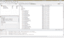

# Android 开发 101-第 4 部分:高级数据库/GUI 代码和 DDMS

> 原文：<https://hackaday.com/2010/08/02/android-development-101-part-4advanced-databasegui-code-and-ddms/>

[](http://hackaday.com/wp-content/uploads/2010/08/header.jpg)

在本教程中，我们将涵盖一些先进的数据库代码，以及配合一些更先进的 GUI 技术。上一篇教程向您展示了如何在数据库中插入和选择数据，以及如何制作表格，我们在[上已经停止了。我们现在需要的是能够删除不需要的数据，并在输入错误时更新数据。我们将把这些功能与一些更高级的功能结合起来，利用长按屏幕来删除和更新，我们只需按下我们想要编辑的数据。](http://hackaday.com/2010/07/21/android-development-101-part-3introduction-to-databases/)

我们将要深入研究的项目来自 Android 开发者网站，名为 [Notepad v2](http://developer.android.com/resources/tutorials/notepad/index.html) ，经过修改后，它更适合我们的 **RandomQuotes** 项目。我们使用一个已经制作好的例子，然后对它进行修改，因为它涵盖了 GUI 和数据库方面更高级的内容，这对于初学者来说是非常好的，对于更高级的用户来说也是非常好的。由于项目将在 ListView 中向我们显示，我们不能再将此项目命名为 RandomQuote，而是使用 EnhancedQuotes 作为我们的项目名称。需要明确的是，我们将创建一个全新的项目，而不是复制另一个项目。以下是制作该项目所需的信息

**项目名称:** EnhancedQuotes
**构建目标:** Android 1.5
**应用名称:** EnhancedQuotes
**包名:**com . gregjacobs . enhanced quotes
**创建活动:** QuotesMain
**Min SDK 版本:** 3

创建项目后，我们可以开始一些更高级的 GUI 工作，并将其与一些更新和删除语句集成。现在，我想开始根据应用程序的需要将我们的代码分成不同的文件。这在现代编程中是很重要的，因为它允许我们保持有组织性，并有效地执行不同屏幕或布局的功能。对于这个项目，我们将把我们的代码分成 3 个*。java* 文件，我们也将有 3 个不同的布局文件。我们将从基础开始，在我们的包**com . Greg Jacobs . enhanced quotes**中创建一个新的类文件，名为 **QuotesDBAdapter** 。这将包含我们的数据库代码，但我们将创建一个新的数据库文件，而不是使用我们以前创建的数据库文件。让我们看看 Google 是怎么做的，看看除了上一篇教程中的原始查询之外还有什么。

[](http://hackaday.com/wp-content/uploads/2010/08/quotedbadapter1.png)[](http://hackaday.com/wp-content/uploads/2010/08/quotedbadapter2.png)[](http://hackaday.com/wp-content/uploads/2010/08/quotedbadapter3.png)[](http://hackaday.com/wp-content/uploads/2010/08/quotedbadapter4.png)[](http://hackaday.com/wp-content/uploads/2010/08/quotedbadapter5.png)[](http://hackaday.com/wp-content/uploads/2010/08/quotedbadapter6.png)

```

package com.gregjacobs.enhancedquotes;

import java.util.Random;

import android.content.ContentValues;
import android.content.Context;
import android.database.Cursor;
import android.database.SQLException;
import android.database.sqlite.SQLiteDatabase;
import android.database.sqlite.SQLiteOpenHelper;
import android.util.Log;

public class QuotesDBAdapter {

	static Random random = new Random();
    public static final String KEY_QUOTES = &quot;quotes&quot;;
    public static final String KEY_ROWID = &quot;_id&quot;;

    private static final String TAG = &quot;QuotesDbAdapter&quot;;
    private DatabaseHelper mDbHelper;
    private SQLiteDatabase mDb;

    /**
     * Database creation sql statement
     */
    private static final String DATABASE_CREATE =
            &quot;create table tblRandomQuotes (_id integer primary key autoincrement, &quot;
                    + &quot;quotes text not null);&quot;;

    private static final String DATABASE_NAME = &quot;Random&quot;;
    private static final String DATABASE_TABLE = &quot;tblRandomQuotes&quot;;
    private static final int DATABASE_VERSION = 2;

    private final Context mCtx;

    private static class DatabaseHelper extends SQLiteOpenHelper {

        DatabaseHelper(Context context) {
            super(context, DATABASE_NAME, null, DATABASE_VERSION);
        }

        @Override
        public void onCreate(SQLiteDatabase db) {

            db.execSQL(DATABASE_CREATE);
        }

        @Override
        public void onUpgrade(SQLiteDatabase db, int oldVersion, int newVersion) {
            Log.w(TAG, &quot;Upgrading database from version &quot; + oldVersion + &quot; to &quot;
                    + newVersion + &quot;, which will destroy all old data&quot;);
            db.execSQL(&quot;DROP TABLE IF EXISTS tblRandomQuotes&quot;);
            onCreate(db);
        }
    }

    /**
     * Constructor - takes the context to allow the database to be
     * opened/created
     *
     * @param ctx the Context within which to work
     */
    public QuotesDBAdapter(Context ctx) {
        this.mCtx = ctx;
    }

    public QuotesDBAdapter open() throws SQLException {
        mDbHelper = new DatabaseHelper(mCtx);
        mDb = mDbHelper.getWritableDatabase();
        return this;
    }

    public void close() {
        mDbHelper.close();
    }

```

看着上面的代码，所有的导入应该看起来很熟悉，以及导致这一点的一切。这是在您的 Android 应用程序中实现的标准数据库代码。在下面的代码中，我们开始将 SQL 语句分成几个部分，并使用前一篇文章中提到的函数。

```

    public long createQuote(String quotes) {
        ContentValues initialValues = new ContentValues();
        initialValues.put(KEY_QUOTES, quotes);

        return mDb.insert(DATABASE_TABLE, null, initialValues);
    }

```

看看 insert 语句，第一个变量是我们要插入的数据库表，下一个变量是如果我们有一组空值，我们要在这里输入，最后一个变量是要插入到表中的值。

```

    public boolean deleteQuote(long rowId) {

        return mDb.delete(DATABASE_TABLE, KEY_ROWID + &quot;=&quot; + rowId, null) &gt; 0;
    }

```

delete 语句在其方法中包含三个值。要输入的第一个变量是数据库表，第二个变量是 where 语句(如果有的话)。在这种情况下，我们将需要它，但在某些情况下，你可能不需要。最后一个变量是 Where 语句参数，但是如果您在前一部分中包含了它们，那也可以。值得注意的是，把“？”并在第三个变量中定义它们。

```

    public Cursor fetchAllQuotes() {

        return mDb.query(DATABASE_TABLE, new String[] {KEY_ROWID, KEY_QUOTES}, null, null, null, null, null);
    }

    public Cursor fetchQuote(long rowId) throws SQLException {

        Cursor mCursor =

                mDb.query(true, DATABASE_TABLE, new String[] {KEY_ROWID,
                        KEY_QUOTES}, KEY_ROWID + &quot;=&quot; + rowId, null,
                        null, null, null, null);
        if (mCursor != null) {
            mCursor.moveToFirst();
        }
        return mCursor;

    }

```

**FetchAllQuotes** 对数据库进行查询，获取 id 和 Quotes 字段，并将所有结果返回给游标。第一个变量是数据库表，第二个是语句应该返回的列，第三个是要返回的列中的行(如果有)，第四个是选择参数，第五个是 group by SQL 函数，第六个是 having SQL 语句，第七个是 order by SQL 函数。为此，我们只填写前两个，其余的可以为空。 **fetchQuote** 使用了相同的函数，但是指定了它所寻找的行。

```

    public boolean updateQuote(long rowId, String title) {
        ContentValues args = new ContentValues();
        args.put(KEY_QUOTES, title);

        return mDb.update(DATABASE_TABLE, args, KEY_ROWID + &quot;=&quot; + rowId, null) &gt; 0;
    }

```

对于 update 语句，我们仍然需要数据库名称、任何给定行的新变量以及要更新的行号。

```

    public int getAllEntries()
    {
        Cursor cursor = mDb.rawQuery(
                    &quot;SELECT COUNT(quotes) FROM tblRandomQuotes&quot;, null);
                if(cursor.moveToFirst()) {
                    return cursor.getInt(0);
                }
                return cursor.getInt(0);

    }

    public String getRandomEntry()
    {
    	int id = 1;
    	id = getAllEntries();

    	int rand = random.nextInt(id) + 1;
        Cursor cursor = mDb.rawQuery(
                    &quot;SELECT quotes FROM tblRandomQuotes WHERE _id = &quot; + rand, null);
                if(cursor.moveToFirst()) {
                    return cursor.getString(0);
                }
                return cursor.getString(0);

    }
}

```

上面提到的这两个函数在上一篇文章中已经提到过了，它们将被用来在屏幕上使用祝酒词生成一个随机的报价。

接下来，我们将涵盖所有的*。以*字符串. xml* 文件开始的 xml* 文件。这将包含所有三个布局 XML 文件的字符串。代码应该非常简单，已经做了两三个例子。 *strings.xml* 如下:

[](http://hackaday.com/wp-content/uploads/2010/08/strings.png)

```

&lt;?xml version=&quot;1.0&quot; encoding=&quot;utf-8&quot;?&gt;
&lt;resources&gt;
    &lt;string name=&quot;app_name&quot;&gt;Quotes Tracker&lt;/string&gt;
    &lt;string name=&quot;no_quotes&quot;&gt;No Quotes Yet&lt;/string&gt;
    &lt;string name=&quot;menu_insert&quot;&gt;Add Quote&lt;/string&gt;
    &lt;string name=&quot;menu_delete&quot;&gt;Delete Quote&lt;/string&gt;
    &lt;string name=&quot;title&quot;&gt;Quote:&lt;/string&gt;
    &lt;string name=&quot;confirm&quot;&gt;Confirm&lt;/string&gt;
    &lt;string name=&quot;edit_quotes&quot;&gt;Edit Quote&lt;/string&gt;
    &lt;string name=&quot;genRan&quot;&gt;Generate Random Quote!&lt;/string&gt;
&lt;/resources&gt;

```

在 *strings.xml* 文件之后，我们将移动到布局文件夹中的 *row.xml* 。它还没有创建，所以我们要创建一个新的 XML 文件。我们通过右击布局文件夹并导航至**新建**，然后导航至**其他…** 来完成此操作。之后，我们将向下滚动，直到找到 **XML** 文件夹。打开它，双击名为 **XML** 的文件。将 XML 文件的名称从 **NewFile.xml** 更改为 **row.xml** 。该文件将被创建，控制台可能会出现并向您显示一个错误，但我们会立即修复该错误。现在我们来看看要插入 XML 文件的代码:

[](http://hackaday.com/wp-content/uploads/2010/08/row.png)

```

&lt;?xml version=&quot;1.0&quot; encoding=&quot;utf-8&quot;?&gt;
&lt;TextView android:id=&quot;@+id/text1&quot; xmlns:android=&quot;http://schemas.android.com/apk/res/android&quot;
    android:layout_width=&quot;wrap_content&quot;
    android:layout_height=&quot;wrap_content&quot;/&gt;

```

这个布局的源代码是一个标签或文本视图，它将为我们拥有的每个条目多次插入到 *main.xml* 中。我们将转到 *main.xml* 向您展示这是如何完成的。

[](http://hackaday.com/wp-content/uploads/2010/08/main.png)

```

&lt;?xml version=&quot;1.0&quot; encoding=&quot;utf-8&quot;?&gt;
&lt;LinearLayout xmlns:android=&quot;http://schemas.android.com/apk/res/android&quot;
android:orientation=&quot;vertical&quot;
android:layout_width=&quot;wrap_content&quot;
android:layout_height=&quot;wrap_content&quot;
&gt;
&lt;ListView android:id=&quot;@+id/android:list&quot;
android:layout_width=&quot;wrap_content&quot;
android:layout_height=&quot;wrap_content&quot;/&gt;
&lt;TextView android:id=&quot;@+id/android:empty&quot;
android:layout_width=&quot;wrap_content&quot;
android:layout_height=&quot;wrap_content&quot;
android:text=&quot;No Quotes!&quot;/&gt;
&lt;Button
android:id=&quot;@+id/genRan&quot;
android:layout_width=&quot;fill_parent&quot;
android:layout_height=&quot;wrap_content&quot;
android:text=&quot;@string/genRan&quot;
/&gt;
&lt;/LinearLayout&gt;

```

我们使用上面的 **LinearLayout** 和 **ListView** 以及一个显示“没有报价”的标签如果数据库为空。即使显示了数据库中的项目，我们也希望随机生成一个，这就是列表视图底部的按钮所做的事情。我们现在可以移动到 *edit.xml* ，这里需要创建一个新的 xml 文件(与上次相同的位置):

[](http://hackaday.com/wp-content/uploads/2010/08/edit.png)

```

&lt;?xml version=&quot;1.0&quot; encoding=&quot;utf-8&quot;?&gt;

&lt;LinearLayout xmlns:android=&quot;http://schemas.android.com/apk/res/android&quot;
	android:orientation=&quot;vertical&quot; android:layout_width=&quot;fill_parent&quot;
	android:layout_height=&quot;fill_parent&quot;&gt;

	&lt;LinearLayout android:orientation=&quot;horizontal&quot;
		android:layout_width=&quot;fill_parent&quot;
		android:layout_height=&quot;wrap_content&quot;&gt;

		&lt;TextView android:layout_width=&quot;wrap_content&quot;
			android:layout_height=&quot;wrap_content&quot;
			android:text=&quot;@string/title&quot; /&gt;
		&lt;EditText android:id=&quot;@+id/title&quot;
		  android:layout_width=&quot;wrap_content&quot;
			android:layout_height=&quot;wrap_content&quot;
			android:layout_weight=&quot;1&quot;/&gt;
	&lt;/LinearLayout&gt;

	&lt;Button android:id=&quot;@+id/confirm&quot;
	  android:text=&quot;@string/confirm&quot;
		android:layout_width=&quot;wrap_content&quot;
		android:layout_height=&quot;wrap_content&quot; /&gt;

&lt;/LinearLayout&gt;

```

上面我们有一个接一个的线性布局，这是因为一个非常特殊的原因。为了能够呈现一个整洁干净的布局，我们必须使用第一个线性布局来垂直对齐所有内容并填充父窗口。之后，第二个线性布局将水平对齐 textbox 和 label。如果没有这两个线性布局，文本框将会是当前屏幕的大小，而不是我们现在拥有的整洁的单行布局。除此之外，布局是漂亮的是基本的，应该没有问题。

接下来我们将创建一个新的*。java* 文件在我们的包**com . Greg Jacobs . enhanced quotes**中被称为 **QuoteEdit** ，它将包含代码来接受我们可能对项目进行的任何编辑。下面是您可能不知道的重要内容的代码和注释，尽管它看起来应该很熟悉，因为我们在以前的帖子中几乎使用了所有这些函数和方法。这里是 QuoteEdit.java 的代码:

[ ](http://hackaday.com/wp-content/uploads/2010/08/quoteedit1.png) [ ](http://hackaday.com/wp-content/uploads/2010/08/quoteedit2.png)

```

package com.gregjacobs.enhancedquotes;

import android.app.Activity;
import android.content.Intent;
import android.os.Bundle;
import android.view.View;
import android.widget.Button;
import android.widget.EditText;

public class QuoteEdit extends Activity {

	private EditText mQuoteText;
    private Long mRowId;

    @Override
    protected void onCreate(Bundle savedInstanceState) {
        super.onCreate(savedInstanceState);
        setContentView(R.layout.edit);

        mQuoteText = (EditText) findViewById(R.id.title);

        Button confirmButton = (Button) findViewById(R.id.confirm);

        mRowId = null;
        Bundle extras = getIntent().getExtras();
        if (extras != null) {
            String title = extras.getString(QuotesDBAdapter.KEY_QUOTES);
            mRowId = extras.getLong(QuotesDBAdapter.KEY_ROWID);

            if (title != null) {
            	mQuoteText.setText(title);
            }
        }

```

在使用**Bundle extras = getintentent()之前，以上都是非常标准的。get extras()；**部分代码。这段代码使用一个*意图*从*QuotesMain.java*中提取。现在一些初学者可能想知道什么是意图。意图是一个被动对象，用于保存可以在应用程序之间传递的数据。用人类的话来说，它是一种粘合剂，使我们能够高效、轻松地从 QuotesMain.java 的文件中获取信息，并将其传送到 QuotesEdit.java 的文件中。另一个新术语是*捆绑包*。bundle 允许将字符串映射到对象，比如我们刚刚谈到的 Intent。因此，通过名为 extras 的包，我们能够从主*中提取数据。java* 文件转移到 QuotesEdit.java*文件，反之亦然。*

```

        confirmButton.setOnClickListener(new View.OnClickListener() {

            public void onClick(View view) {
                Bundle bundle = new Bundle();

                bundle.putString(QuotesDBAdapter.KEY_QUOTES, mQuoteText.getText().toString());
                if (mRowId != null) {
                    bundle.putLong(QuotesDBAdapter.KEY_ROWID, mRowId);
                }

                Intent mIntent = new Intent();
                mIntent.putExtras(bundle);
                setResult(RESULT_OK, mIntent);
                finish();
            }

        });
    }
}

```

上面的包将用对象的原始 ID 打包文本框中的当前文本，并通过*QuotesEdit.java*将其发送回【QuotesMain.java】T2。我们现在准备前往 QuotesMain.java 的*，在那里我们将把迄今为止所做的一切整合在一起。这段代码将实现长按项目，以及利用任何电话上的菜单按钮来调出一个添加功能。下面是在*QuotesMain.java*中使用的代码:*


```

package com.gregjacobs.enhancedquotes;

import android.app.ListActivity;
import android.view.View.OnClickListener;
import android.content.Context;
import android.content.Intent;
import android.database.Cursor;
import android.os.Bundle;
import android.view.ContextMenu;
import android.view.Menu;
import android.view.MenuItem;
import android.view.View;
import android.view.ContextMenu.ContextMenuInfo;
import android.widget.ListView;
import android.widget.Button;
import android.widget.SimpleCursorAdapter;
import android.widget.Toast;
import android.widget.AdapterView.AdapterContextMenuInfo;

```

上面我们有几个新的进口，能够在这个项目中使用更先进的项目，如意图，菜单和菜单项，列表视图和简单的 cursoradapters。这些问题一出现就会得到解释。

```

public class QuotesMain extends ListActivity {
    private static final int ACTIVITY_CREATE=0;
    private static final int ACTIVITY_EDIT=1;

    private static final int INSERT_ID = Menu.FIRST;
    private static final int DELETE_ID = Menu.FIRST + 1;

    private QuotesDBAdapter mDbHelper;
    private Cursor mNotesCursor;

    public Button button;
    /** Called when the activity is first created. */
    @Override
    public void onCreate(Bundle savedInstanceState) {
        super.onCreate(savedInstanceState);
        setContentView(R.layout.main);
        mDbHelper = new QuotesDBAdapter(this);
        mDbHelper.open();
        fillData();
        registerForContextMenu(getListView());
        button = (Button)findViewById(R.id.genRan);
        button.setOnClickListener(mAddListener);
    }

```

我们为创建、编辑、插入和删除创建变量，并使它们成为静态变量，因为它们不会改变。在 onCreate 函数中，我们利用了 **fillData()** ，这将在下面定义。您还会注意到，我们在上下文菜单中注册了 listview 项，并为按钮设置了一个侦听器。上下文菜单最好被描述为一种弹出菜单，当我们想要删除列表视图中的一个项目时，就会用到它。

```

    private OnClickListener mAddListener = new OnClickListener()
    {
    	public void onClick(View v)
    	{
			//long id1 = 0;
			// do something when the button is clicked
			try
			{
				String quote = &quot;&quot;;
				quote = mDbHelper.getRandomEntry();
				Context context = getApplicationContext();
				CharSequence text = quote;
				int duration = Toast.LENGTH_LONG;

				Toast toast = Toast.makeText(context, text, duration);
				toast.show();
			}
			catch (Exception ex)
			{
				Context context = getApplicationContext();
				CharSequence text = ex.toString();
				int duration = Toast.LENGTH_LONG;

				Toast toast = Toast.makeText(context, text, duration);
				toast.show();
			}
    	}
    };

    private void fillData() {
        // Get all of the rows from the database and create the item list
        mNotesCursor = mDbHelper.fetchAllQuotes();
        startManagingCursor(mNotesCursor);

        // Create an array to specify the fields we want to display in the list (only TITLE)
        String[] from = new String[]{QuotesDBAdapter.KEY_QUOTES};

        // and an array of the fields we want to bind those fields to (in this case just text1)
        int[] to = new int[]{R.id.text1};

        // Now create a simple cursor adapter and set it to display
        SimpleCursorAdapter notes =
        	    new SimpleCursorAdapter(this, R.layout.row, mNotesCursor, from, to);
        setListAdapter(notes);
    }

```

上面的按钮功能与前面的一个完全一样，用于从我们的列表中生成随机报价。上面提到的新方法 **fillData()** 将用于获取所有报价，并将 ID 和实际报价绑定在一起，并使用 **SimpleCursorAdapter** 将它们添加到 listview。 **SimpleCursorAdapter** 用于将返回光标中的绑定列绑定到我们放在屏幕上的任何文本。

```

    @Override
    public boolean onCreateOptionsMenu(Menu menu) {
        super.onCreateOptionsMenu(menu);
        menu.add(0, INSERT_ID,0, R.string.menu_insert);
        return true;
    }

    @Override
    public boolean onMenuItemSelected(int featureId, MenuItem item) {
        switch(item.getItemId()) {
        case INSERT_ID:
            createNote();
            return true;
	    }
        return super.onMenuItemSelected(featureId, item);
    }

```

在上面第一个名为 **onCreateOptionsMenu()** 的函数中，我们添加了使用菜单按下选项向数据库添加项目的功能，这将打开一个对话框，询问我们是否愿意这样做。如果成功完成，该语句将返回 true。它下面的按钮检查菜单中的某个项目是否被按下。如果有，它使用 switch 语句来检查我们上面定义的值。如果匹配，那么我们创建一个注释，定义如下。

```

    @Override
	public void onCreateContextMenu(ContextMenu menu, View v,
			ContextMenuInfo menuInfo) {
		super.onCreateContextMenu(menu, v, menuInfo);
        menu.add(0, DELETE_ID, 0, R.string.menu_delete);
	}

    @Override
	public boolean onContextItemSelected(MenuItem item) {
		switch(item.getItemId()) {
    	case DELETE_ID:
    		AdapterContextMenuInfo info = (AdapterContextMenuInfo) item.getMenuInfo();
	        mDbHelper.deleteQuote(info.id);
	        fillData();
	        return true;
		}
		return super.onContextItemSelected(item);
	}

	private void createNote() {
    	Intent i = new Intent(this, QuoteEdit.class);
    	 startActivityForResult(i, ACTIVITY_CREATE);
   	 }

```

上面的函数用于注册上下文菜单，并使用 menu.add 函数给出删除项目的选项，如上面和这里所见。如果上下文菜单项 Delete 被按下，那么数据库助手将根据 ID 删除报价。 **createNote()** 函数使用一个意图将应用程序传递到 QuoteEdit 文件并加载一个新的屏幕，完成后，一个新的意图会将完成的数据发送回这里，这样我们就可以将它添加到 listview 中。

```

    @Override
    protected void onListItemClick(ListView l, View v, int position, long id) {
    	super.onListItemClick(l, v, position, id);
        Cursor c = mNotesCursor;
        c.moveToPosition(position);
        Intent i = new Intent(this, QuoteEdit.class);
        i.putExtra(QuotesDBAdapter.KEY_ROWID, id);
        i.putExtra(QuotesDBAdapter.KEY_QUOTES, c.getString(
                c.getColumnIndexOrThrow(QuotesDBAdapter.KEY_QUOTES)));
        startActivityForResult(i, ACTIVITY_EDIT);
    }

```

如果 listview 中的一个项目被按下，上面的函数将被加载以初始化一个 intent，并将信息放入 intent 中，并将其拖到 QuoteEdit 类中进行编辑。完成后，QuoteEdit 类会将完成的数据发送回来，我们可以继续添加、编辑或删除更多的项目。

```

    @Override
    protected void onActivityResult(int requestCode, int resultCode, Intent intent) {
        super.onActivityResult(requestCode, resultCode, intent);
        Bundle extras = intent.getExtras();
        switch(requestCode) {
        case ACTIVITY_CREATE:
            String title = extras.getString(QuotesDBAdapter.KEY_QUOTES);
            mDbHelper.createQuote(title);
            fillData();
            break;
        case ACTIVITY_EDIT:
            Long rowId = extras.getLong(QuotesDBAdapter.KEY_ROWID);
            if (rowId != null) {
                String editTitle = extras.getString(QuotesDBAdapter.KEY_QUOTES);
                mDbHelper.updateQuote(rowId, editTitle);
            }
            fillData();
            break;
        }
    }
}

```

上面的方法获取活动的结果，并使用该结果来利用特定的方法。在这种情况下，结果要么是创建一个新报价，要么是编辑一个现有报价。这个 switch 语句的基础是利用数据库助手，在数据库中插入数据或更新数据。

在模拟器上运行我们的应用程序之前，我们现在还有一个文件要查看。这将是安卓的清单。XML 文件，它将控制注册什么和运行什么，它本质上是程序的核心，我们需要它来识别我们的应用程序有两个部分。这是机器人清单的代码:

[](http://hackaday.com/wp-content/uploads/2010/08/androidmanifest.png)

```

&lt;?xml version=&quot;1.0&quot; encoding=&quot;utf-8&quot;?&gt;
&lt;manifest xmlns:android=&quot;http://schemas.android.com/apk/res/android&quot; package=&quot;com.gregjacobs.enhancedquotes&quot;&gt;
    &lt;application android:icon=&quot;@drawable/icon&quot;&gt;
        &lt;activity android:name=&quot;.QuotesMain&quot; android:label=&quot;@string/app_name&quot;&gt;
            &lt;intent-filter&gt;
                &lt;action android:name=&quot;android.intent.action.MAIN&quot; /&gt;
                &lt;category android:name=&quot;android.intent.category.LAUNCHER&quot; /&gt;
            &lt;/intent-filter&gt;
        &lt;/activity&gt;
    	&lt;activity android:name=&quot;.QuoteEdit&quot; android:label=&quot;@string/app_name&quot;&gt;&lt;/activity&gt;
    &lt;/application&gt;
&lt;/manifest&gt;

```

如果你的代码看起来不像这样，那么你将不得不对你的代码做一些修改以使它看起来像这样。您会注意到，我们已经向清单文件添加了另一个**活动**，并给它起了与上面那个相同的名字 **app_name** 。这表示我们有另一个想要使用的活动，我们在这里注册它。另外，你会注意到**使用的-SDK Android:minSdkVersion = " 3"**已经被去掉了。这是因为应用程序并不真正需要它，但拥有它总是好的。这只是将它作为一个参考，并将在构建应用程序时使用指定的构建目标。

[](http://hackaday.com/wp-content/uploads/2010/08/demo1.png)[](http://hackaday.com/wp-content/uploads/2010/08/demo2.png)[](http://hackaday.com/wp-content/uploads/2010/08/demo3.png)[](http://hackaday.com/wp-content/uploads/2010/08/demo4.png)

应用程序应该构建完成，您将能够尝试 Android 编程的更多高级功能。你学到的知识有无限的可能性，但是如果你的数据库/数据库代码不工作怎么办？

这就是达尔维克调试监控服务器(DDMS) 的用途。当模拟器运行时，我们可以切换到 DDMS，方法是转到屏幕右上方，按下 **> >** ，然后点击**【DDMS】**。如果你是 Android 开发的新手，这个新屏幕会让你很困惑。我们现在去 DDMS 的目的是能够从我们的仿真器中添加和取出感兴趣的项目。对于这个特别的教程，我们将从正在运行的模拟器中获取一个数据库。

在我们开始之前，我们需要下载一些我认为对 SQLite 开发者非常有用的软件。这就是 [SQLite 数据库浏览器](http://sqlitebrowser.sourceforge.net/) (SDB)。该软件将允许您打开 SQLite 数据库并探索其内容，甚至通过 SQL 语句修改它们。文件下载完成后，找到文件夹并点击*。exe* 启动它。让这个程序运行起来，我们稍后再回到它。

为了能够将它们放入 SDB，我们需要将它们从模拟器中取出。要做到这一点，我们必须深入运行模拟器，找到我们想要的数据库。关键是要记住，数据库是特定于应用程序的，所以我们需要找到包名，数据库将位于数据库文件夹下。在 DDMS 时，请转到“设备”选项卡，然后单击我们的仿真器。然后在程序中间应该有一个名为**文件浏览器**的标签。点击文件浏览器后，我们会看到三个文件夹(可能更多，这取决于你对设备的操作)，分别是**数据**、**sd 卡**和**系统**。我们将暂时保留**系统**和**SD 卡**，因为我们要使用**数据**文件夹，所以打开它。打开后，导航到另一个名为 data 的文件夹并打开它。现在我们看到了安装在模拟器上的所有东西的包名。导航到**com . Greg Jacobs . enhanced quotes**并打开它。一旦打开，出现的两个文件夹应该是**数据库**和**库**。打开数据库文件夹，取出名为**的随机文件**。现在，为了能够获取该文件，我们将单击它一次，然后导航到选项卡的顶部并按下按钮，该按钮看起来像一个带有指向左侧箭头的**软盘**。单击此图标后，会出现一个对话框，询问您要将所选文件保存在哪里。选择一个容易找到的位置，然后单击保存。

[ ](http://hackaday.com/wp-content/uploads/2010/08/ddms1.png) [ ](http://hackaday.com/wp-content/uploads/2010/08/ddms2.png)

从模拟器中取出文件后，我们将返回 SDB，单击大的“打开”按钮，找到我们保存的文件，然后单击“打开”。一旦文件打开，我们就能够看到数据库的结构，并导航浏览数据。为此，我们将单击名为**浏览数据**的选项卡，并在旁边的下拉列表中选择 **tblRandomQuotes** 。现在，表中的数据将会出现，如果您需要修改某些内容并将其放回模拟器，现在您知道在哪里可以找到您的数据。如果您不确定返回的数据是什么，SDB 也非常适合测试 SQL 查询。如果你在 Android 上做数据库应用，这将是一个无价的工具。

以下是我的项目中用于比较的文件:

[androidmanifest . XML](http://hackaday.com/wp-content/uploads/2010/08/androidmanifest-xml.doc)|[edit . XML](http://hackaday.com/wp-content/uploads/2010/08/edit-xml.doc)|[main . XML](http://hackaday.com/wp-content/uploads/2010/08/main-xml.doc)|[QuoteEdit.java](http://hackaday.com/wp-content/uploads/2010/08/quoteedit-java.doc)|[QuoteMain.java](http://hackaday.com/wp-content/uploads/2010/08/quotemain-java.doc)|[QuotesDBAdapter.java](http://hackaday.com/wp-content/uploads/2010/08/quotesdbadapter-java.doc)|[row . XML](http://hackaday.com/wp-content/uploads/2010/08/row-xml.doc)|[strings . XML](http://hackaday.com/wp-content/uploads/2010/08/strings-xml.doc)

现在，您已经对一些可用的 GUI 选项和本教程中详细介绍的数据库代码有了深入的了解，您已经准备好开始开发一些比单击按钮更有深度的应用程序了。有了对意图和捆绑包的理解，你就可以使你的程序更加全面，并划分你的代码和布局以符合你的期望。如果任何人在学习本教程后有了自己的想法，请随时发送给我，我们可以看看你学到了什么。下一篇教程将介绍如何设计统计跟踪器，以及如何使用 [DroidDraw](http://www.droiddraw.org/) 来开发一些 UI。直到下一个教程，黑客快乐！

用于参考的文章:

[谷歌记事本教程](http://developer.android.com/resources/tutorials/notepad/index.html)–[记事本 V2](http://developer.android.com/resources/tutorials/notepad/notepad-ex2.html)

继续第 5 部分: [DroidDraw &信息追踪器完成](http://hackaday.com/2010/08/05/android-development-101-part-5droiddraw-information-tracker-completed/)

43.002684-81.21499*