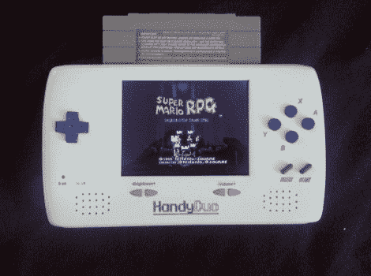

# 手持播放 SNES 和 NES 推车

> 原文：<https://hackaday.com/2010/08/02/handheld-plays-snes-and-nes-carts/>

[Lovable Chevy] finished her portable build, ending up with [a handheld that takes both SNES and NES cartridges](http://forums.benheck.com/viewtopic.php?f=18&t=38653). We’ve got to say congratulations on reaching the finish line as her first [build log](http://forums.benheck.com/viewtopic.php?f=3&t=23372) post was in March of ’08\. But it was worth the wait. The little device, which is a mash-up of the hardware from a [Retro Duo](http://en.wikipedia.org/wiki/Retro_Duo) along with a PSone screen and 4250 mAh battery, looks quite nice thanks to her skill and patience when building the case. Take a look at the obligatory demo video after the break. <https://www.youtube.com/embed/mX36JHB1ONc?version=3&rel=1&showsearch=0&showinfo=1&iv_load_policy=1&fs=1&hl=en-US&autohide=2&wmode=transparent>

 </body> </html>