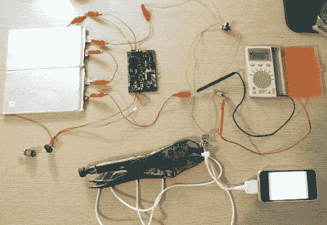

# 对自行车动力系统的探索

> 原文：<https://hackaday.com/2010/08/03/the-quest-for-a-bicycle-power-system/>

[Garote]一直非常忙。忙着在他的自行车上安装一个电气系统，甚至忙着写一篇关于它的纪念文章。他涵盖了令人印象深刻的一系列主题，从给自行车添加发电机、电池、充电系统、灯和配件的目标开始。在那里，他一次只做一件事，研究并订购一个带有发电机轮毂的轮子，组装并测试他的电池，选择充电系统的控制板，并设计像上面的 iPhone 充电器这样的附件电路。如果他给两轮车[增加太多东西，他将不得不计划一次大型公路旅行。](http://hackaday.com/2009/09/18/vintage-video-computing-across-america/)

[感谢 Xuxo]