# Android 开发 101–第 5 部分:DroidDraw 和信息跟踪器完成

> 原文：<https://hackaday.com/2010/08/05/android-development-101-part-5droiddraw-information-tracker-completed/>

[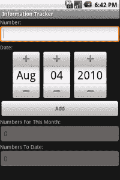](http://hackaday.com/wp-content/uploads/2010/08/header.png)

在本教程中，我们将涵盖使用 DroidDraw 设计这个项目的布局来完成信息跟踪器。这将让您深入了解 eclipse 环境中库存布局管理器的替代方案，以及 DroidDraw 是如何工作的。在设计 Android 应用程序时，DroidDraw 可能是你最好的朋友，如果你不知道应用程序的布局和工作原理，它也可能是你最糟糕的敌人。这将向您展示这个程序的基础，以及如何将它整合到您的开发过程中。这比之前的要简单得多，但会教授其他项目的技能，以帮助开发，如 DroidDraw。

我们将从下载 [DroidDraw](http://www.droiddraw.org/) 开始，并使用下载的*启动它。exe* 解压文件后。程序启动后，界面非常简单。程序的左侧是设备屏幕，以及我们运行该应用程序时的样子。应用程序的右侧为您提供了可以放在屏幕上半部分的对象，并在下半部分显示生成的代码。这是一个非常独特的程序，因为你不仅可以选择在右屏幕的下半部分生成代码，还可以粘贴代码并生成一个你的程序的布局，以进一步增强它。下面的图片会给你一个布局的概念，所以下面的段落会简单一些:

[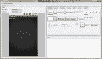](http://hackaday.com/wp-content/uploads/2010/08/droiddraw1.png)[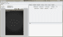](http://hackaday.com/wp-content/uploads/2010/08/droiddraw2.png)[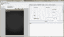](http://hackaday.com/wp-content/uploads/2010/08/droiddraw3.png)

首先我们将把屏幕上的**绝对布局**改为**滚动视图**。为此，我们导航到程序左上角的下拉菜单，显示 **RootLayout** ，并将其更改为 **ScrollView** 。然后，我们将通过导航到选项卡所在程序的右上方并单击**布局**来将**线性布局**添加到屏幕。将标题为 **LinearLayout** 的图标拖到左边的屏幕上。现在，当它仍然被选中时，转到右边名为**属性**的选项卡并点击它。我们正在将 **LinearLayout** 的宽度和高度更改为 *fill_parent* ，然后点击 **Apply** 进行更改。回到**布局**屏幕，我们将选择**表格布局**并将其放入**线性布局**中，然后转到**属性**并在高度和宽度上将其更改为 *fill_parent* 。

现在我们已经整理好了布局，我们将开始把小部件放到屏幕上，使界面更具交互性。首先，我们需要一个要求输入数字的标签。将一个 **TextView** 从 widget 选项卡拖放到屏幕上，然后进入属性，将宽度改为 *fill_parent* ，将文本改为 **Number:** 。现在，我们需要在标签下添加一个文本框(也称为 EditText ),这样我们就可以将它从窗口小部件中拖到屏幕上，并将 width 的属性更改为 *fill_parent* ，将文本更改为空白字段，将 id 更改为 **@+id/NumRewards** 。然后我们添加另一个标签，使用 *fill_parent* 作为宽度，并将文本更改为 **Date:** 并应用更改。现在，我们在标签下添加一个 **DatePicker** ，并将 id 更改为 **@+id/Date** ，并应用这些更改。现在我们需要一个按钮，当它被按下时能够从我们的表单中提取信息，所以拖动一个按钮，将 id 改为 **@+id/Add** ，将文本改为 **Add** ，然后单击 **Apply** 。在这一点上，我们必须添加 2 个以上的标签和 2 个以上的文本框，所以我会让你完成这一点，并给你的信息来改变他们。第一个标签的文本需要更改为这个月的**数字:**，第一个需要更改的文本框变量是 id goes to**@+id/rewards monthly**。第二个标签将需要说迄今为止的**数字:**，第二个文本框的 ID 将需要更改为 **@+id/RewardsTD** 。如果出现问题，代码将在下面给出，但摆弄 DroidDraw 的界面是学习用它生成界面的最快方法的最佳方式。

现在我们的界面已经设计好了，我们需要使用程序顶部的按钮 **Generate** 来生成它。这将填充屏幕的右下角，您可以复制并粘贴到 *main.xml* 文件中。当将代码粘贴到 xml 文件中时，您会在上面的截图中注意到，按钮下面的“我的文本框”是灰色的。这是通过在 EditText 节点的结束 *>* 前添加 **android:enabled="false"** 来实现的。这将允许你显示信息，不让任何人改变它。下面是 DroidDraw 生成的代码，其中没有添加启用的功能:

[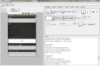](http://hackaday.com/wp-content/uploads/2010/08/droiddrawfinished.png)

```

&lt;?xml version=&quot;1.0&quot; encoding=&quot;utf-8&quot;?&gt;
&lt;ScrollView
android:id=&quot;@+id/widget33&quot;
android:layout_width=&quot;fill_parent&quot;
android:layout_height=&quot;fill_parent&quot;
xmlns:android=&quot;http://schemas.android.com/apk/res/android&quot;
&gt;
&lt;LinearLayout
android:id=&quot;@+id/widget29&quot;
android:layout_width=&quot;fill_parent&quot;
android:layout_height=&quot;fill_parent&quot;
android:orientation=&quot;vertical&quot;
&gt;
&lt;TableLayout
android:id=&quot;@+id/widget34&quot;
android:layout_width=&quot;fill_parent&quot;
android:layout_height=&quot;fill_parent&quot;
android:orientation=&quot;vertical&quot;
&gt;
&lt;TextView
android:id=&quot;@+id/widget35&quot;
android:layout_width=&quot;fill_parent&quot;
android:layout_height=&quot;wrap_content&quot;
android:text=&quot;Number:&quot;
&gt;
&lt;!--&lt;span class=&quot;hiddenSpellError&quot; pre=&quot;&quot;--&gt;TextView&gt;
&lt;EditText
android:id=&quot;@+id/NumRewards&quot;
android:layout_width=&quot;fill_parent&quot;
android:layout_height=&quot;wrap_content&quot;
android:textSize=&quot;18sp&quot;
android:phoneNumber=&quot;true&quot;
&gt;
&lt;!--&lt;span class=&quot;hiddenSpellError&quot; pre=&quot;&quot;--&gt;EditText&gt;
&lt;TextView
android:id=&quot;@+id/widget37&quot;
android:layout_width=&quot;fill_parent&quot;
android:layout_height=&quot;wrap_content&quot;
android:text=&quot;Date:&quot;
&gt;
&lt;!--&lt;span class=&quot;hiddenSpellError&quot; pre=&quot;&quot;--&gt;TextView&gt;
&lt;DatePicker
android:id=&quot;@+id/Date&quot;
android:layout_width=&quot;wrap_content&quot;
android:layout_height=&quot;wrap_content&quot;
&gt;
&lt;!--&lt;span class=&quot;hiddenSpellError&quot; pre=&quot;&quot;--&gt;DatePicker&gt;
&lt;Button
android:id=&quot;@+id/Add&quot;
android:layout_width=&quot;wrap_content&quot;
android:layout_height=&quot;wrap_content&quot;
android:text=&quot;Add&quot;
&gt;
&lt;/Button&gt;
&lt;TextView
android:id=&quot;@+id/widget41&quot;
android:layout_width=&quot;wrap_content&quot;
android:layout_height=&quot;wrap_content&quot;
android:text=&quot;Numbers For This Month:&quot;
&gt;
&lt;/TextView&gt;
&lt;EditText
android:id=&quot;@+id/RewardsMonthly&quot;
android:layout_width=&quot;wrap_content&quot;
android:layout_height=&quot;wrap_content&quot;
android:textSize=&quot;18sp&quot;
android:enabled=&quot;false&quot;
&gt;
&lt;!--&lt;span class=&quot;hiddenSpellError&quot; pre=&quot;&quot;--&gt;EditText&gt;
&lt;TextView
android:id=&quot;@+id/widget43&quot;
android:layout_width=&quot;wrap_content&quot;
android:layout_height=&quot;wrap_content&quot;
android:text=&quot;Numbers To Date:&quot;
&gt;
&lt;/TextView&gt;
&lt;EditText
android:id=&quot;@+id/RewardsTD&quot;
android:layout_width=&quot;wrap_content&quot;
android:layout_height=&quot;wrap_content&quot;
android:textSize=&quot;18sp&quot;
android:enabled=&quot;false&quot;
&gt;
&lt;!--&lt;span class=&quot;hiddenSpellError&quot; pre=&quot;&quot;--&gt;EditText&gt;
&lt;/TableLayout&gt;
&lt;/LinearLayout&gt;
&lt;/ScrollView&gt;

```

下面是布局文件中实现了 **enabled="false"** 的截图:

[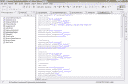](http://hackaday.com/wp-content/uploads/2010/08/main1.png)[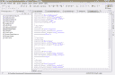](http://hackaday.com/wp-content/uploads/2010/08/main2.png)[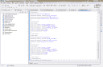](http://hackaday.com/wp-content/uploads/2010/08/main3.png)

现在我们的布局已经完成，我们可以开始制作项目了。我们已经走过了如何从以前的职位，所以这应该是熟悉的项目。这次我将把这个项目完全交给你来做。项目完成后，我们可以开始为我们将大量使用的数据库编码适配器。到目前为止，大部分功能都是标准的，除了我们希望使用特定标准获取数据的 select 函数。这是 DBAdapter.java 的代码:

[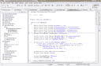](http://hackaday.com/wp-content/uploads/2010/08/dbadapter1.png)[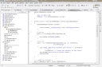](http://hackaday.com/wp-content/uploads/2010/08/dbadapter2.png)[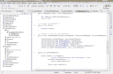](http://hackaday.com/wp-content/uploads/2010/08/dbadapter3.png)

[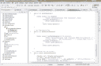 ](http://hackaday.com/wp-content/uploads/2010/08/dbadapter4.png) [ 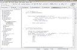](http://hackaday.com/wp-content/uploads/2010/08/dbadapter5.png)

```

package com.gregjacobs.infotracker;
/**
 * @author Greg
 *
 */
import java.util.Calendar;
import java.util.Date;
import android.content.ContentValues;
import android.content.Context;
import android.database.Cursor;
import android.database.SQLException;
import android.database.sqlite.SQLiteDatabase;
import android.database.sqlite.SQLiteOpenHelper;
import android.util.Log;

public class DBAdapter
{
	public static final String KEY_ROWID = &quot;_id&quot;;
    public static final String KEY_YEAROFREWARDS = &quot;YearOfRewards&quot;;
    public static final String KEY_MONTHOFREWARDS = &quot;MonthOfRewards&quot;;
    public static final String KEY_DAYOFREWARDS = &quot;DayOfRewards&quot;;
    public static final String KEY_NUMOFREWARDS = &quot;NumOfRewards&quot;;
    private static final String TAG = &quot;DBAdapter&quot;;

    private static final String DATABASE_NAME = &quot;BlockbusterRewards&quot;;
    private static final String DATABASE_TABLE = &quot;tblRewards&quot;;
    private static final int DATABASE_VERSION = 1;

    private static final String DATABASE_CREATE =
        &quot;create table tblRewards (_id integer primary key autoincrement, &quot;
        + &quot;YearOfRewards text not null, MonthOfRewards text not null,&quot; +
        		&quot;DayOfRewards text not null,&quot; +
        		&quot; NumOfRewards int not null );&quot;;

    private static final Date date = new Date();
    private final Context context;

    private DatabaseHelper DBHelper;
    private SQLiteDatabase db;

```

从我们目前看到的来看，上面的代码相当标准。我想指出的唯一一点是，我为日、月和年各准备了一列，而不是将它们组合成一行。我这样做是为了在引用月和日时可以快速完成，而无需在 SQL 语句中添加太多代码。其余的应该看起来很熟悉。

```

    public DBAdapter(Context ctx)
    {
        this.context = ctx;
        DBHelper = new DatabaseHelper(context);
    }

	private static class DatabaseHelper extends SQLiteOpenHelper
    {
        DatabaseHelper(Context context)
        {
            super(context, DATABASE_NAME, null, DATABASE_VERSION);
        }

        @Override
        public void onCreate(SQLiteDatabase db)
        {
            db.execSQL(DATABASE_CREATE);
        }

        @Override
        public void onUpgrade(SQLiteDatabase db, int oldVersion,
                              int newVersion)
        {
            Log.w(TAG, &quot;Upgrading database from version &quot; + oldVersion
                  + &quot; to &quot;
                  + newVersion + &quot;, which will destroy all old data&quot;);
            db.execSQL(&quot;DROP TABLE IF EXISTS titles&quot;);
            onCreate(db);
        }
    }

    //---opens the database---
    public DBAdapter open() throws SQLException
    {
        db = DBHelper.getWritableDatabase();
        return this;
    }

    //---closes the database---
    public void close()
    {
        DBHelper.close();
    }

    //---insert a title into the database---
    public long insertRewards(String yearRewards, String monthRewards, String dayRewards, String numRewards)
    {
        ContentValues initialValues = new ContentValues();
        initialValues.put(KEY_YEAROFREWARDS, yearRewards);
        initialValues.put(KEY_MONTHOFREWARDS, monthRewards);
        initialValues.put(KEY_DAYOFREWARDS, dayRewards);
        initialValues.put(KEY_NUMOFREWARDS, Integer.parseInt(numRewards));
        return db.insert(DATABASE_TABLE, null, initialValues);
    }

    public int getAllRewards()
    {
        Cursor cursor = db.rawQuery(
                    &quot;SELECT SUM(NumOfRewards) FROM tblRewards&quot;, null);
                if(cursor.moveToFirst()) {
                    return cursor.getInt(0);
                }
                return cursor.getInt(0);

    }

    public int getMonthlyRewards()
    {

        Cursor cursor = getMonthRewards();/*db.rawQuery(
                    &quot;SELECT SUM(NumOfRewards) FROM tblRewards WHERE MonthOfRewards = &quot; +
                    Calendar.MONTH + &quot; AND YearOfRewards = &quot; + Calendar.YEAR, null);*/
                if(cursor.moveToFirst()) {
                    return cursor.getInt(0);
                }
                return cursor.getInt(0);

    }

  //---retrieves all the titles---
    public Cursor getMonthRewards()
    {
    	Calendar cal = Calendar.getInstance();
    	int year = cal.get(Calendar.YEAR);
    	String WHERE = &quot;MonthOfRewards = &quot; + date.getMonth() + &quot; AND YearOfRewards = &quot; + year;
        return db.query(DATABASE_TABLE, new String[] {
        		&quot;SUM(&quot; + KEY_NUMOFREWARDS + &quot;)&quot;},
                WHERE,
                null,
                null,
                null,
                null);
    }
}

```

**getMonthlyRewards** 获取 **getMonthRewards()** 方法中与特定月份相关的所有项目，并将它们显示在我们将在布局中使用的按钮下的一个文本框中。将调用 **getAllRewards()** 方法来显示我们到目前为止获得的项目的累积。

我们现在进入*。我们标记为 InfoTracker.java*的 java* 文件。该文件将利用代码将事件侦听器附加到我们布局中的按钮，当按下按钮时，它将更新下面的文本框。这个*中的代码。java* 文件没有针对效率进行优化，它被设计成只工作。我对你的挑战是理解这段代码，如果你不喜欢它的样子，那就做得更好。这里是 InfoTracker.java 的代码:*

[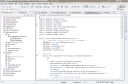](http://hackaday.com/wp-content/uploads/2010/08/infotracker1.png)[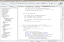](http://hackaday.com/wp-content/uploads/2010/08/infotracker2.png)[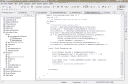](http://hackaday.com/wp-content/uploads/2010/08/infotracker3.png)

```

package com.gregjacobs.infotracker;

import android.app.Activity;
import android.content.Context;
import android.os.Bundle;
import android.view.View;
import android.view.View.OnClickListener;
import android.widget.Button;
import android.widget.DatePicker;
import android.widget.EditText;
import android.widget.Toast;

public class InfoTracker extends Activity {
    /** Called when the activity is first created. */
	DBAdapter db = new DBAdapter(this);
	EditText rewards;
	EditText rewardsMonthly;
	EditText rewardsTD;
	DatePicker dateRewards;

    @Override
    public void onCreate(Bundle savedInstanceState) {
    	try
    	{
	        super.onCreate(savedInstanceState);
	        setContentView(R.layout.main);
	        rewardsTD = (EditText)findViewById(R.id.RewardsTD);
	        rewardsMonthly = (EditText)findViewById(R.id.RewardsMonthly);
	        db.open();
	        rewardsTD.setText(String.valueOf(db.getAllRewards()));
	        rewardsMonthly.setText(String.valueOf(db.getMonthlyRewards()));
	        db.close();
	        // Capture our button from layout
	        Button button = (Button)findViewById(R.id.Add);
	        // Register the onClick listener with the implementation above
	        button.setOnClickListener(mAddListener);

    	}
        catch (Exception ex)
        {
      	  Context context = getApplicationContext();
      	  CharSequence text = ex.toString();
      	  int duration = Toast.LENGTH_LONG;

      	  Toast toast = Toast.makeText(context, text, duration);
      	  toast.show();
      	  //System.out.println(ex.getMessage());
        }
    }

    // Create an anonymous implementation of OnClickListener
    private OnClickListener mAddListener = new OnClickListener() {
        public void onClick(View v) {
        long id = 0;
          // do something when the button is clicked
    	db.open();
    	try{
    		//setContentView(R.layout.main);
			rewards = (EditText)findViewById(R.id.NumRewards);
		    dateRewards = (DatePicker)findViewById(R.id.Date);
		    rewardsMonthly = (EditText)findViewById(R.id.RewardsMonthly);
		    rewardsTD = (EditText)findViewById(R.id.RewardsTD);
		    id = db.insertRewards(String.valueOf(dateRewards.getYear()),
		    		String.valueOf(dateRewards.getMonth()),
		    		String.valueOf(dateRewards.getDayOfMonth()),
		    		rewards.getText().toString());
		    rewardsTD.setText(String.valueOf(db.getAllRewards()));
            rewardsMonthly.setText(String.valueOf(db.getMonthlyRewards()));
          }
          catch (Exception ex)
          {
        	  Context context = getApplicationContext();
        	  CharSequence text = ex.toString() + &quot;ID = &quot; + id;
        	  int duration = Toast.LENGTH_LONG;

        	  Toast toast = Toast.makeText(context, text, duration);
        	  toast.show();
        	  //System.out.println(ex.getMessage());
          }

          db.close();

        }
    };
}

```

本例中的代码在其他教程中都有涉及，唯一的例外是，当我们启动该应用程序时，我们调用数据库并查看是否有新的内容，并且在我们按下按钮后调用，以不断更新下面文本框中的数字。此外，我们在打电话后关闭数据库的事实不同于我们所做的其他应用，因为这可能会减少电池的使用，而不是让它一直开着。我们要做的最后一部分是 *strings.xml* 文件，代码如下:

```

&lt;?xml version=&quot;1.0&quot; encoding=&quot;utf-8&quot;?&gt;
&lt;resources&gt;
    &lt;string name=&quot;app_name&quot;&gt;Information Tracker&lt;/string&gt;
&lt;/resources&gt;

```

以下是我的项目中的文件，因此您可以使用它们进行比较:

[DBAdapter.java](http://hackaday.com/wp-content/uploads/2010/08/dbadapter-java.doc)|[InfoTracker.java](http://hackaday.com/wp-content/uploads/2010/08/infotracker-java.doc)|[main . XML](http://hackaday.com/wp-content/uploads/2010/08/main-xml1.doc)

现在我们已经完成了信息跟踪器，并对 DroidDraw 的工作原理有了基本的了解。这是我们系列的倒数第二个教程，所以 Android 开发 101 就要结束了，只剩下最后一站了。下一篇教程将介绍如何将您的应用程序打包并签名到？apk 文件，您可以轻松地将其部署到自己的设备上，或者使用 Android Market 在世界范围内推广。直到下一个教程，黑客快乐！

继续第 6 部分:[准备上市！](http://hackaday.com/2010/08/10/android-development-101-part-6getting-ready-for-market/)

43.002684-81.21499