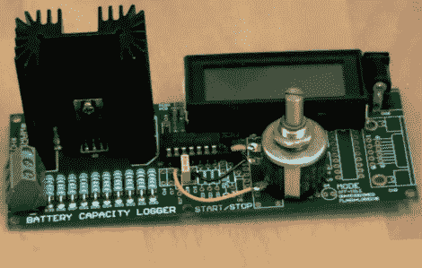

# 假负载和散热器

> 原文：<https://hackaday.com/2010/08/06/dummy-loads-and-heat-sinks/>

在[Dave]最新一集的 EEVblog [中，他看了一下恒流假负载](http://www.eevblog.com/2010/08/01/eevblog-102-diy-constant-current-dummy-load-for-power-supply-and-battery-testing/)。这些用于测试电源设计，而不是每次他决定开发一个工具来完成这项工作时仅仅将阻性负载连接在一起。他最终得到的是一个可靠的恒流负载，可以在 1.5 毫安到 1A 以上的任何地方拨号。甚至有一个板载仪表，所以你不必在使用前探测设置。

这看起来像是他把他的设计送到了板房进行生产，但那实际上是一个再利用的 PCB。在走过他的垃圾箱组装假负载时，[Dave]分享了一些很好的技巧，如使用多个 1%电阻，而不是使用一个大而精确的功率电阻。但我们最喜欢的部分是在 12 点左右，他带我们通过一些粗略的数学计算散热器。我们总是猜测，但像任何好老师一样，[戴夫]解释理论，然后测量实际性能，把猜测从设计中剔除。休息之后自己看吧。[https://www.youtube.com/embed/8xX2SVcItOA?version=3&rel=1&showsearch=0&showinfo=1&iv_load_policy=1&fs=1&hl=en-US&autohide=2&wmode=transparent](https://www.youtube.com/embed/8xX2SVcItOA?version=3&rel=1&showsearch=0&showinfo=1&iv_load_policy=1&fs=1&hl=en-US&autohide=2&wmode=transparent)

[感谢 Strider_mt2k]