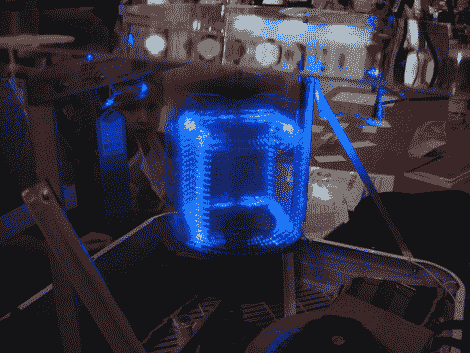

# 旋转 Peggy，获取 3D 视点

> 原文：<https://hackaday.com/2010/08/09/spin-peggy-get-3d-pov/>

在五月份收到几个 LED 球后，我们暂时禁止发布 POV 项目。但在看到由[韦斯·法勒]和[唐·史密斯]制作的这款出色的[立体 3D 视点显示器](https://sites.google.com/site/wdmaker2010/project-definition/volumetric-display)后，我们不得不取消禁令。

他们创造性地使用几个现成的组件，增加了诱人的设置；中心元素只是一个盒子风扇和来自 T2 EMSL 的佩吉基特。跳转后的视频并没有真正做到项目公正，但如果你错过了在[底特律](http://makerfaire.com)的创客博览会，不能自己制作，这是你能得到的最好的。

[https://www.youtube.com/embed/6xtUwAwZf0E?version=3&rel=1&showsearch=0&showinfo=1&iv_load_policy=1&fs=1&hl=en-US&autohide=2&wmode=transparent](https://www.youtube.com/embed/6xtUwAwZf0E?version=3&rel=1&showsearch=0&showinfo=1&iv_load_policy=1&fs=1&hl=en-US&autohide=2&wmode=transparent)