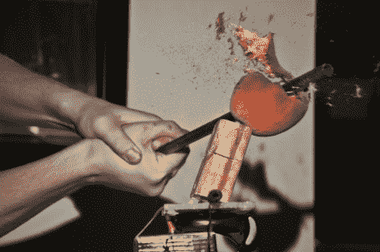

# 用压力板适时抓拍照片

> 原文：<https://hackaday.com/2010/08/11/snapping-pics-at-the-right-moment-with-a-pressure-plate/>

[BiOzZ]制造了一个[压力感应相机配件](http://biozz.deviantart.com/art/triggerd-flash-explained-174807893)在合适的时候抓拍照片。在关掉所有的灯之前，相机设置了一个 20 秒的定时器和 3 秒的曝光时间。压力板并不拍照，而是在拍摄过程中发出闪光来捕捉图像。

黑客使用一块丙烯酸作为压力板的基础。开关的构造是将铝带放在底座上，并附上一条弯曲的薄金属带，以增加一点弹性。当一个物体放在平板上，薄金属接触铝带完成电路，重量的变化打破它。一个简单的电路连接到这一点，使用继电器启动一次性相机的闪光灯。这是记录你锻炼最近一直在消耗你的水果引起的愤怒的完美时刻。