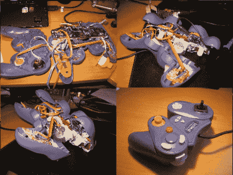

# 单手 GameCube 控制器

> 原文：<https://hackaday.com/2010/08/12/one-handed-gamecube-controller/>

[哈塞] [为他的兄弟制造了一个单手视频游戏控制器](http://hacks.hasse.nl/107/wii/single-handed-game-controller/)。他把他需要的一切都装进了一个现有控制器的主体，并设计出了一个非常实用的系统。控制器将只适用于右手，所以左肩按钮被移到了右手中指可以够到的地方。这使得 d-pad 和左边的模拟杆需要考虑。通过组合 ATtiny44A、加速度计和数模转换器，控制器可以感知运动。微控制器读入加速度计数据，通过 d-pad 上增加的四个 led 向用户提供反馈，DAC 将适当的信号反馈给控制器，就像您在使用操纵杆一样。甚至有一个开关来选择运动数据是映射到模拟棒还是 d-pad。休息之后，我们还提供了一段演示视频。

发现还需要一些独臂打字辅助？看看这个半 qwerty 键盘黑客。T3

<https://www.youtube.com/embed/45A2glYyezo?version=3&rel=1&showsearch=0&showinfo=1&iv_load_policy=1&fs=1&hl=en-US&autohide=2&wmode=transparent>

 
[感谢维姆和耶鲁安通过<a href="http://tweakers.net/nieuws/69051/tweaker-maakt-gamecontroller-geschikt-voor-eenhandige-bediening.html" target="_blank">调整</a>
 </body> </html>