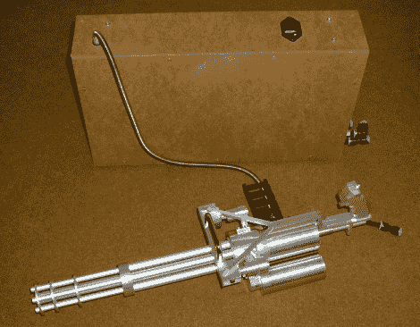

# 气枪迷你枪威力很大

> 原文：<https://hackaday.com/2010/08/12/airsoft-minigun-packs-quite-a-punch/>

建造了一个多管气枪迷你炮，拥有令人难以置信的射速和几乎用之不竭的弹药包。枪完全由铝制成，这意味着要在数控机床上工作一段时间。六个桶不旋转，但它们都被使用，导致了视频中显示的大屠杀。你看到的那个大盒子是弹药包，它可以容纳 16，000 个 bb，并使用电动馈送系统来达到必要的交付速度。作为自动炮塔[的一部分，这肯定不是你想要碰到的东西。](http://hackaday.com/2009/04/09/portal-ish-automated-turret/)

 <https://www.youtube.com/embed/gsKLQlPxCG8?version=3&rel=1&showsearch=0&showinfo=1&iv_load_policy=1&fs=1&hl=en-US&autohide=2&wmode=transparent>

 
[via <a href="http://hackedgadgets.com/2010/08/11/multi-barrel-airsoft-machine-gun/" target="_blank">被黑的小工具</a>
 </body> </html>