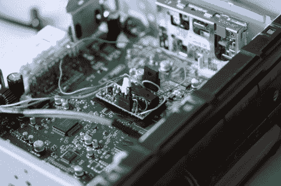

# 向旧的主机添加输入

> 原文：<https://hackaday.com/2010/08/12/adding-an-input-to-an-old-head-unit/>

汽车里的磁带盒？是的，在光学媒体占领道路之前，这种情况非常普遍。[Nirav Patel]2004 年的丰田卡罗拉有一个卡座，他用它配了一个磁带适配器，以便从他的 iPhone 上听音乐。但是有一天发生了一些事情，虽然适配器仍然工作，但是卡带播放器开始发出令人分心的噪音。[Nirav]着手消除噪音，[为音响系统安装辅助音频输入](http://eclecti.cc/hardware/normal-people-dont-have-these-problems)。一路上有一些绊脚的地方，比如打碎所有东西和点起一堆小火，但是坚持不懈让他达到了目标。因为这些单元是为兼容 CD 换碟机等设备而构建的，所以它们有一个名为 AVC-Lan 的通信总线。这个协议已经被[发现并记录了](http://www.softservice.com.pl/corolla/avc/avclan.php)，【尼拉夫】甚至发现了[一个现存的音频输入黑客](http://www.sigmaobjects.com/toyota/)，他的设计就是基于这个。现在，他能够直接插入仪表板，抛弃卡带适配器。

我们以前看过几次[Nirav 的]作品。他向我们展示了第一人称射击游戏控制器，他的网站是我们在 T2 发布的用 Linux 编程的资源。

[通过[使](http://blog.makezine.com/archive/2010/08/adding_an_auxiliary_input_to_a_2004.html)