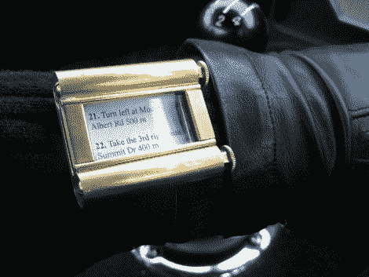

# 谷歌地图手环导航器

> 原文：<https://hackaday.com/2010/08/14/google-maps-wristlet-navigator/>

这个[腕上导航系统](http://www.asciimation.co.nz/bb/2010/08/14/brass-wristlet-google-maps-navigator-watch)使用谷歌地图和一种叫做……纸的东西。这是对 20 世纪 20 年代和 30 年代基于滚动的方向的一种倒退，是西蒙发明的。他将几根铜管焊接到一个黄铜背板上，然后添加侧面和一个面水晶。现在，他从流行的地图网站上打印出一步一步的指示，并把它们缠绕在卷轴上。我们不确定我们会花时间这样做，但嘿，至少屏幕分辨率很棒，你不必担心电池寿命。