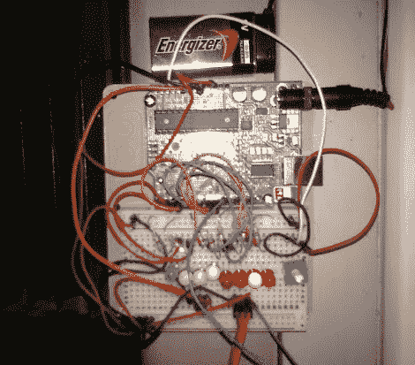

# 超级简单的 Arduino 设置降低了电费

> 原文：<https://hackaday.com/2010/08/17/super-simple-arduino-setup-lowers-electricity-bills/>

一个有 40 行代码的 Arduino，一个温度电阻，和伺服系统都是真正需要的，用[这个恒温器](http://undiscoveredfeatures.blogspot.com/2010/08/thermostat.html)(彼得·汉密尔顿)来节省一些钱。还增加了发光二极管和电位计，以帮助设置和读取所需的温度。不管有没有所述的附加部件，黑客仍然简单得可笑，我们想知道为什么在看到它之前，我们没有在我们极其寒冷的办公室空调系统上进行类似的设置。

不过，我们的版本更进一步，计划增加定时器，以便在没人在办公室时长时间关闭系统。你想补充什么？