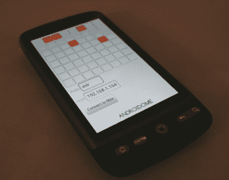

# Android ome:Android 单体

> 原文：<https://hackaday.com/2010/08/16/androidome-monome-for-android/>

[伊万·海明威]向我们透露了他的新安卓应用 Android ome。这是他通过[我们的 Android 开发教程](http://hackaday.com/2010/07/12/android-development-101-%e2%80%93-a-tutorial-series/)后制作的第一个。它将运行在他的 Android 2.1 设备上的应用程序与运行 Max/MSP 5 的计算机相结合。这两者不需要被束缚，他们只需要在同一个无线网络上。如果你在做现场表演，这不是最好的解决方案，因为屏幕上的按钮非常小。但是正如你在休息之后所看到的，这是一个很好的进入单体界面工作的方式，并且决定你是否想要[建立一个工具的专用物理版本](http://hackaday.com/2010/01/12/arduinome-with-many-pots/)。

 <https://www.youtube.com/embed/BKGSVqYQFiY?version=3&rel=1&showsearch=0&showinfo=1&iv_load_policy=1&fs=1&hl=en-US&autohide=2&wmode=transparent>

 </body> </html>