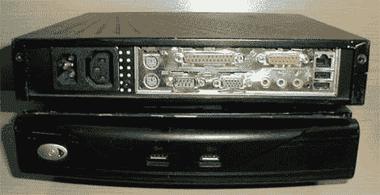

# 修复伊托纳 VXL 瘦客户端

> 原文：<https://hackaday.com/2010/08/17/repairing-the-itona-vxl-thin-client/>

[吉姆]是 11 个不工作的伊托娜 VXL 瘦客户的快乐接收者。他收到的是 800Mhz CPUs，256MB 内存和 256 MB 存储空间。没有一个能启动。经过内部检查，他发现了一个共同的主题。电源中泄漏的膨胀电容器。由于这些都带有定制的 50W 电源，他选择[简单地更换盖子，而不是更换电源本身](http://www.geek-republic.com/2010/08/15/itona-vxl-thin-client-repair/)。现在他有 11 个功能齐全的单位。他的网站上有很多很棒的图片和大量信息，但他没有谈到他打算用这些图片做什么。

你为什么不到我们的[黑客 Q & A 来告诉我们你会怎么处理他们](http://answers.hackaday.com/what-would-you-do-with-11-itona-vxl-thin-clients-the-specs-are-gigabyte-p3vb-vxl-mini-itx-motherboard-anless-via-c3-800-mhz-cpu-with-a)。