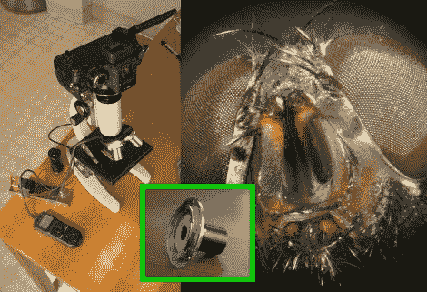

# 显微镜摄像头适配器

> 原文：<https://hackaday.com/2010/08/20/microscope-camera-adapter/>

[Ben Krasnow]正在使用显微镜适配器和一些技巧捕捉一些精彩的快照[。相机附件只是一个镜头适配器环加上一个管。不像](http://benkrasnow.blogspot.com/2010/03/microphotgraphy-with-lumix-gh1.html)[我们见过的其他显微镜成像黑客](http://hackaday.com/2010/02/16/microscope-lens-hack/)他使用了一个真正的显微镜，但发现照片有一点光线失真。摄像机传感器捕捉到了黑色灯管内部反射的强光。通过增加一个垫圈和重新定位仪器，他克服了那个障碍。拼图的最后一部分是图像处理。通过以不同的焦距拍摄几张照片，然后将它们合成，他得到了杀手级的照片，就像上面看到的那只家蝇的复眼。