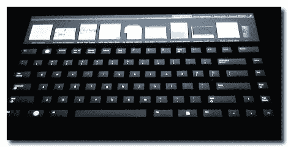

# 微软工程师重新发明了 Optimus 键盘

> 原文：<https://hackaday.com/2010/08/20/microsoft-engineers-reinvent-the-optimus-keyboard/>

看起来微软已经推出了一款非常光滑的小键盘。它很像[的擎天柱](http://www.artlebedev.com/everything/optimus/)，每个键都有一个有机发光二极管屏幕，只不过不是每个键都有屏幕。相反，整个装置只有一个屏幕，按键覆盖在上面，同时允许图像显示出来。真的很棒，因为这将大大降低原来 2400 美元的价格。也就是说，如果你能买这个设备的话。微软不会出售这种硬件(至少现在不会)，但会作为测试硬件提供给[尤斯特创新大赛](http://microsofthardwareblog.com/how-will-input-devices-evolve-to-help-information-workers/)。看看学生们想出了什么将会很有趣。这种键盘应该更容易编程，因为它只涉及操纵一个屏幕。顶部还有额外的触摸感应空间。休息之后自己看吧。

 <https://www.youtube.com/embed/ojusRO38Tdc?version=3&rel=1&showsearch=0&showinfo=1&iv_load_policy=1&fs=1&hl=en-US&autohide=2&wmode=transparent>

 
[通过<a href="http://www.gizmodo.com.au/2010/08/only-students-will-get-to-use-microsofts-lcd-screen-keyboard/" target="_blank"> Gizmodo </a>感谢 FaSMaN
 </body> </html>