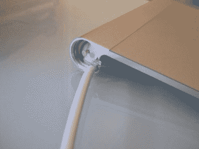

# 用 USB 电源替换电池

> 原文：<https://hackaday.com/2010/08/19/replace-batteries-with-usb-power/>

[Mark Bog]认为他的桌面触摸板使用电池是一种浪费。坦率地说，我们同意，如果你可以避免使用一次性电池，你应该这样做。他抛弃了魔力轨迹板中的双 AA 电池，并且[制造了一个电池大小的适配器来给它充电](http://forums.macrumors.com/showthread.php?t=980351)。它包括一个直径相似的销钉，两端各有一个螺钉。他找出一根 USB 线，将火线和地线连接到适配器的相应电极上。现在，他的触控板由 USB 供电，永远不需要更换电池，甚至不需要充电。

我们并不熟悉苹果 Magic Trackpad 的内部工作原理。我们假设里面有一个电压调节器，我们希望它在使用来自适配器的 5V 稳压电源时不会有问题。如果你对硬件有所了解，我们很乐意在评论中听到。最后一件事:因为上面链接的论坛需要登录才能查看帖子中的图片，为了您的方便，我们在休息后嵌入了其余的图片。

    

[感谢 Patrick 的提示和图片]