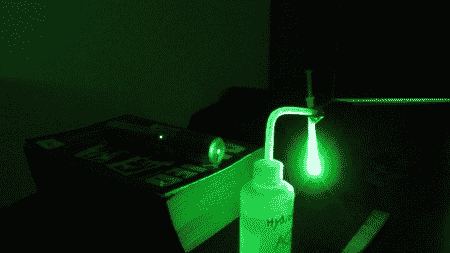

# 激光显微镜投影

> 原文：<https://hackaday.com/2010/08/21/laser-microscope-projection/>

好，我们先说，看激光会伤害你的眼睛。小心点。既然我们已经完全清楚了这一点，我们不禁发现这个[超级快速和肮脏的激光显微镜](http://teravolt.org/Laser_Microscope.htm)令人着迷。基本上，他们只是将激光对准一滴悬挂在注射器顶端的水。空投物资的图像被投射到附近的墙上。休息后的视频中看到的水滴取自盆栽植物，你可以看到各种各样的生命在那里蠕动。只是不要用[这种激光](http://hackaday.com/2010/08/20/1w-blue-laser-remarkably-easy-and-dangerous/)去尝试。

[via [HackedGadgets](http://hackedgadgets.com/2010/08/20/diy-laser-microscope/)

 <https://www.youtube.com/embed/2aK_a-jr-tI?version=3&rel=1&showsearch=0&showinfo=1&iv_load_policy=1&fs=1&hl=en-US&autohide=2&wmode=transparent>

 </body> </html>