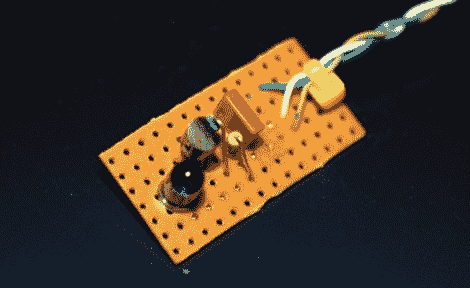

# 给予红外发射器一些强度

> 原文：<https://hackaday.com/2010/08/22/giving-an-ir-transmitter-some-strength/>

[Jkx]使用 Thomson VS360U 视频发射器在有线电视盒和他的电视机之间建立无线连接。该系统使用射频遥控器，但依靠红外发射器在基站和有线电视盒之间进行通信。他发现设备自带的红外模块供电不足，于是[着手解决这个问题](http://www.larsen-b.com/Article/364.html)。使用一个范围，他发现了针驱动红外发光二极管。上面的电路板包含一个升压电路，可以接入电压和接地，使用何频来控制晶体管的基极。现在，该设备有足够的电力来可靠地控制电缆箱。