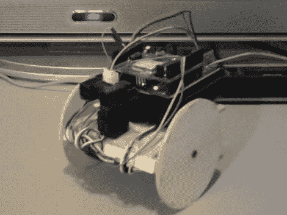

# WiFi 控制的 Arduino-bot

> 原文：<https://hackaday.com/2010/08/23/wifi-controlled-arduino-bot/>

得益于 Arduino 的快速原型制作能力，这个小机器人的制造速度非常快。它使用来自 AsyncLabs 的 [WiShield 1.0 通过 TCP 连接连接到无线网络进行控制。车身和车轮是木制的，每个马达都有一个伺服系统，第三个用于从一侧到另一侧扫描测距仪。休息之后，我们嵌入了三个演示视频，带您了解该平台的各种功能开发。你会看到通过](http://asynclabs.com/)[一个被黑掉的 Zipit](http://hackaday.com/2009/09/25/with-zipit-who-needs-a-netbook/) 的控制，以及操纵杆控制。在自主运动的几个阶段中，距离信息也发挥了作用。

Zipit 控件:

[https://www.youtube.com/embed/BSYBrEvtsis?version=3&rel=1&showsearch=0&showinfo=1&iv_load_policy=1&fs=1&hl=en-US&autohide=2&wmode=transparent](https://www.youtube.com/embed/BSYBrEvtsis?version=3&rel=1&showsearch=0&showinfo=1&iv_load_policy=1&fs=1&hl=en-US&autohide=2&wmode=transparent)

提高自主性:

[https://www.youtube.com/embed/q_qXa6eLjSs?version=3&rel=1&showsearch=0&showinfo=1&iv_load_policy=1&fs=1&hl=en-US&autohide=2&wmode=transparent](https://www.youtube.com/embed/q_qXa6eLjSs?version=3&rel=1&showsearch=0&showinfo=1&iv_load_policy=1&fs=1&hl=en-US&autohide=2&wmode=transparent)

操纵杆控制:

[https://www.youtube.com/embed/65u9FBEoGVE?version=3&rel=1&showsearch=0&showinfo=1&iv_load_policy=1&fs=1&hl=en-US&autohide=2&wmode=transparent](https://www.youtube.com/embed/65u9FBEoGVE?version=3&rel=1&showsearch=0&showinfo=1&iv_load_policy=1&fs=1&hl=en-US&autohide=2&wmode=transparent)