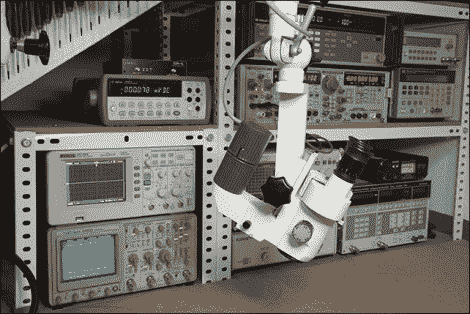

# 手术显微镜获得 LED 改造

> 原文：<https://hackaday.com/2010/08/24/surgical-microscope-gets-led-retrofit/>

[Roberto Barrios]拿起一个手术显微镜，添加到你在背景中看到的其他有趣的实验室玩具中。当焊接小部件时，这些显微镜非常好用，因为它们不需要像传统显微镜那样靠近被观察物体。但是[罗伯特]不在乎白炽灯泡产生的热量，所以他自己制造了 LED 替代品。如果你知道他的名字，那是因为我们看到了[一个制作精美的内置 GPS 系统](http://hackaday.com/2010/04/20/gps-embedded-in-visor/)，它是他在四月份建造的。这个项目展示了同样的工艺水平，他利用一个备用灯泡的底座添加了一个 LED，散热器和驱动板，可在所有三个轴上调节。

他还提到，他彻底修改了自己的网站设计，现在可以很好地与所有浏览器兼容。