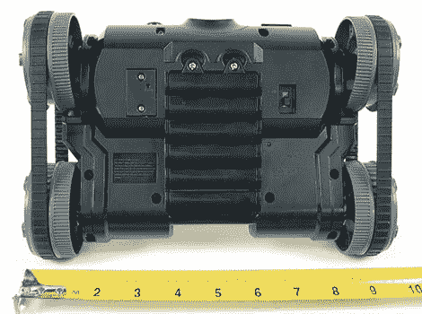
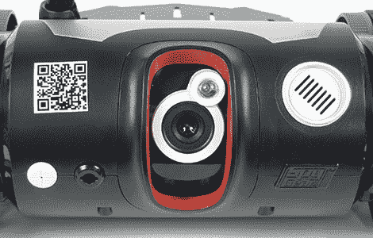

# 间谍视频追踪:第一印象

> 原文：<https://hackaday.com/2010/08/27/spy-video-trakr-first-impressions/>

在今年 5 月的湾区制造商博览会上，我们第一次看到了野生星球的间谍视频 TRAKR ，这是一个 130 美元的无线电控制玩具，在引擎盖下有一些惊喜。

从表面上看，Spy Video TRAKR——流行的 *Spy Gear* 玩具系列的最新成员——是一个带有摄像机和夜视功能的遥控坦克，具有从互联网下载新“应用程序”的额外功能。只要做一点侦查工作，你就会发现 TRAKR 的秘密双重生活:它也是一个非常容易破解的机器人平台！以前的间谍装备玩具一直是受欢迎的黑客目标，提供廉价、大规模生产的不寻常物品，如头戴式显示器。Wild Planet 没有设置障碍，而是选择拥抱这个二级市场，计划发布开发工具和文档，使扩展设备的功能成为可能。

请继续阅读我们的图片-沉重的拆箱和初步印象。

Wild Planet provided us a unit for testing, with their assurance that this is identical to the package now arriving on store shelves.

 

包装从表面上看是面向消费者的——首先，这毕竟是一个儿童玩具——“USB 连接”和“下载和构建定制应用程序”的标签就像它的外表一样技术化。

不含电池。你需要很多。你有没有想过在玩具反斗城的任何东西上会提到 Linux 的名字？厉害！

内部包装极简，并且大部分可回收利用。没有扭带，没有订书钉，没有塑料泡沫，没有登记卡或目录。非常感谢！我们已经看到很多[更小的玩具和更多的免费包装](http://hackaday.com/2010/03/28/leapfrog-didj/)，所以这是一个受欢迎的解脱。

箱子的全部内容如下:

*   TRAKR 车辆本身，天线处于收起位置。
*   snap-on“transport deck”似乎除了在即将到来的 YouTube 视频洪流中为美国大兵乔(G.I. Joe)或可爱的小猫提供一个座位之外，没有什么用处。
*   遥控单元。
*   单页说明书。
*   四英尺长的香蕉黄色 USB A 到迷你 B 电缆。

TRAKR 车辆是一个短粗，矮胖的坦克，大约 10 英寸宽，7 英寸长。六节 AA 电池安装在单元底部的盖子后面。碱性电池的总重量为 1065 克，约 2 磅 5 盎司。单手轻松拿起。

TRAKR 车辆的前部装有许多传感器。从左到右，这些包括:麦克风(左侧的白色圆圈)，一个目前未使用的附件连接端口，其中似乎包含一个撞击开关，彩色摄像机和红外 LED 用于[夜视](http://hackaday.com/2005/01/26/homemade-night-vision-scope/)，以及扬声器(右侧较大的白色圆圈)。摄像机可以从正前方旋转到向上 30 度左右，但是这个功能没有[伺服](http://hackaday.com/2009/11/06/servo-database/)控制；必须手动定位。

履带车的后轮有独立的电动机；前轮是被动的，由橡胶胎面驱动。所有的轮子都由三角形安全螺丝固定，所以用花哨的遥控汽车轮胎来替换它们可能不容易。

随着运输甲板的拆除，我们可以看到 TRAKR 背面的端口:用于存储照片和视频的 [SD 卡](http://hackaday.com/2010/03/14/storage-for-your-hacking-needs/)插槽(也兼容 SDHC)，用于连接 PC(或 Mac 等)的 USB mini-B 连接器。)，以及一个 USB 型连接器，目前没有任何用途，但可能与未来的配件(当然还有黑客)有关。

当连接到主机时，TRAKR 显示为 1 兆字节的 FAT12 文件系统。从 Spy Video TRAKR 网站下载的新应用程序只需复制相应的。将文件绑定到该闪存驱动器上的应用程序目录。在这方面，它与 [mbed 微控制器](http://hackaday.com/2009/11/21/review-mbed-nxp-lpc1768-microcontroller/)颇有几分相似。随着三个工厂应用程序的预装，还有大约 900K 的可用空间。此外，通过 USB 连接时，TRAKR 可用作 SD 读卡器。

遥控器的高度和宽度都超过了 5 英寸。四节 AA 电池安装在后盖后面，总重量为 392 克，约 13.5 盎司。控制器的尺寸和重量对于年轻人和成年人的手来说都足够舒适。有两个单轴操纵杆用于驱动坦克 *Battlezone* 风格，五个按钮(一个专用于“home”功能，其余是应用程序专用的)，一个电源和音量开关，扬声器，以及中央的 1.75 英寸彩色液晶显示屏。虽然操纵杆有一种模拟的感觉，但实际上它们似乎是简单的非比例控制。

LCD 看起来是半 QVGA 分辨率(160×120)。通过该设备的无线(2.4 GHz，但不是 WiFi)连接，视频传输平均每秒 15 帧。

夜视由单个 8 毫米近红外 LED 提供，范围约为 6 英尺。

该相机还可以拍摄 QVGA (320×240)彩色静止图像和半 QVGA (160×120)视频，分别以 JPEG 和 AVI 格式录制到 SD 卡上。下面是一些直接来自存储卡的未处理剧照:

在户外使用时，我们注意到一个有趣的现象，由于相机对红外光的敏感性，大多数树木看起来是红色的。对于在正常光线下在室内拍摄的图像来说，这通常不是问题。

TRAKR 的运行比我们预期的要安静一些，在清除门槛或在不同的地板表面之间运行时没有任何问题。距离地面仅两英寸多一点的相机似乎有可疑的效用——例如， [WowWee Rovio 移动网络摄像头](http://hackaday.com/2010/03/17/woot-how-to-let-there-be-light-for-your-rovio/)可以提升大约一英尺的角度以获得更好的视角——老实说，起初整个事情似乎有点毫无意义。但是，我们花越多的时间开车，进入心态，重温我们年轻时与[大 Trak](http://en.wikipedia.org/wiki/Big_Trak) (类似于 TRAKR 的 20 世纪 80 年代前身)一起度过的无数个小时，就越明显地发现，这是玩具预期受众的理想视角:孩子们不是在考虑边缘过滤器和物体跟踪算法……他们在做*重要的儿童事情*，执行詹姆斯·邦德间谍任务，撞倒动作人物和军人，追逐猫。正如你在上面看到的，摄像机被完美地设置在了令人毛骨悚然的高度！

这是 TRAKR 的概述，因为它是直接从箱子里出来的。要做更多，我们首先访问间谍视频 TRAKR 网站:

“下载应用程序”链接目前指向大约十几个内部开发的简单应用程序列表:

没有一款 app 特别出众；它们似乎是为了说明的目的，每一个都展示了一个单独的想法，并且不想压倒初露头角的程序员。大多数范围从大约 20 到 40 千字节。

点击一个应用程序名称会显示更多信息——描述、编译后应用程序的下载链接，以及我们这些极客的源代码链接。不幸的是，这就是乐趣现在结束的地方。在线工作的代码编辑器和编译器“APP BUILDR”(也像前面提到的 [mbed](http://hackaday.com/2010/06/17/no-nonsense-mbed-development-demo/) 微控制器)还不可用:

不不不。

间谍视频 TRAKR 最初计划在今年秋天的假日购物季推出。Wild Planet 在将 TRAKR 投入生产和分销方面取得了良好的开端——我们已经有了这个玩具，你已经可以在许多零售商那里找到它——但该软件仍按原计划于 10 月发布。我们理解软件时间表，并同情这一现实，但这并不意味着如果你对 TRAKR 的主要兴趣是编程，就没有什么紧迫感。它可以等待。

在此期间，我们可以开始用可用的少量信息解构开发过程。从 Maker Faire 中，我们确实知道 TRAKR 包含一个 [ARM9](http://hackaday.com/2009/12/23/reverse-engineering-off-brand-media-players/) 处理器，并且是用 c 语言编程的。虽然代码编辑器尚未上线，但我们可以通过“下载源代码”链接来获取应用程序的源代码。以下是其中一个演示程序的摘录:

事实上，它是 C 语言，只是简单地包装了一些函数(例如 Start()和 Run()而不是 main()函数)。显然有一个间谍视频 TRAKR 专用的 API (svt.h)用于访问硬件功能，如 TRAKR 的电机或控制器的按钮和显示器，但这个库的文档还不能在网上获得。

在这一点上，我们仍然完全是在处理标准的、宣传的、开箱即用的功能。TRAKR 真正让我们在 [Maker Faire](http://hackaday.com/2010/05/24/bay-area-maker-faire-2010-in-pictures/) 停下来注意的事情，让我们真正对该产品充满热情的事情，尽管这篇文章现在听起来可能像是一个完全的企业推诿(我们首先接触了他们)，与该玩具的复活节彩蛋有着密切的关系:

这是一个令人惊叹的细节:背面端口上方磨砂封面上清晰的字母暗示着里面有趣的东西。盖子只需用几个普通的十字螺丝就能固定住。我说，你是那种好奇的孩子，会拆开他们的玩具，看看是什么让他们工作？我们也这么认为。

外部:消费者的 URL。内部:好奇者的网址。只差几分之一英寸和一张塑料薄片。它非常棒，在包装和标准网站上都没有提到这一点。

所以——除了标准的应用程序网站，第二个网站(遗憾的是，这个网站目前还没有完成)计划更深入地研究系统的内部工作。但是，即使没有这些信息，我们也可以通过检查他们深思熟虑地标记的板子，看到未来的暗示。我们可以辨认出一个未填充的第三个 USB 端口，一个未填充的开关连接器，一个看起来有八条 [GPIO](http://hackaday.com/2008/12/05/working-with-relays/) 线和一个模拟输入的分接头，以及一个用于某种 [SPI](http://hackaday.com/2009/12/22/modular-systems-using-spi/) 端口的更小的分接头(可能是调试)。

此外，TRAKR 和遥控器都有隐藏在检修面板下的开关和端口:

TRAKR 上的微调电位计几乎肯定是用来调谐无线电收发器的。两个单元上的开关一个位置标有“USB ”,另一个位置标有“SPI ”,这似乎与调试或闪存编程有关。两个开关都在“SPI”位置发货。

令人鼓舞的是，间谍视频 TRAKR 在其他开放机器人的带领下，如 [Roomba](http://hackaday.com/2010/04/08/roomba-dissection-videos/) 和 [Rovi](http://hackaday.com/2010/04/28/mind-controlled-rovio/) ，我们希望看到它获得类似的追随者。内心可能还有更多惊喜。随着我们的基本审查完成，观看黑客一天一个完整的[拆卸](http://hackaday.com/2009/11/27/four-tear-downs-for-your-friday-afternoon/)在未来。

那么，读者们，你们能为这样的设备设想出什么样的破解方法呢？伸缩摄像杆？六足动物的腿？武器？在我们的拆解过程中，您希望看到更深入的调查吗？在评论里听听吧！