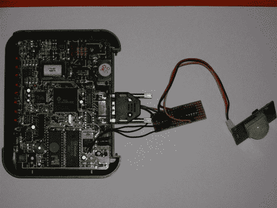

# 报警系统中使用的调制解调器

> 原文：<https://hackaday.com/2010/08/25/modem-used-in-an-alarm-system/>

这个[报警系统感应运动，然后通过电话](http://english.sistemasorp.es/2010/08/25/alarm-with-pic-16f628-ds275-transceiver-motion-sensor-and-old-modem/)提醒你。[Oscar]有一个旧的外部调制解调器，通过一些明智的硬件选择，他想出了一个简单的电路来使用它。首先选择 PIC 16F628A，因为它不需要外部晶振。它通过 DS275 RS232 收发器与调制解调器连接，因为它不需要外部连接部件。拼图的最后一部分是一个 PIR 传感器，它触发睡眠 PIC 中的 pin 中断，然后拨打你的号码来提醒你。看起来除了你的电话铃响之外没有别的事情发生，但是对于一个简单的系统来说这已经足够了。我们只是很高兴看到使用那个调制解调器是多么容易…是时候去可怕的垃圾箱子里找一个了。不要错过休息后的片段。

 <https://www.youtube.com/embed/WYHL4va0dgY?version=3&rel=1&showsearch=0&showinfo=1&iv_load_policy=1&fs=1&hl=en-US&autohide=2&wmode=transparent>

 </body> </html>