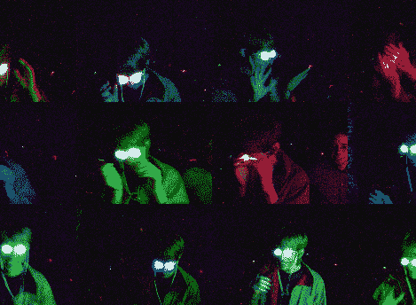

# LED 护目镜让你绊倒？

> 原文：<https://hackaday.com/2010/08/26/led-goggles-make-you-trip-out/>

Who knows if this works and should you really want to try to induce hallucinations by flashing colors in front of your eyes? But we do love the zaniness of the project. [Everett’s] homemade hallucination goggles come in two flavors, [the small swimming-goggle-type](http://wealoneonearth.blogspot.com/2009/09/how-to-build-goggles.html) model and the [heavy-duty trip visor](http://wealoneonearth.blogspot.com/2010/05/do-it-yourself-trip-visor.html) made from welder’s goggles. Each brings together the same components; a half ping-pong ball for each eye to diffuse the light from an RGB LED. The system is controlled by an Arduino with some buttons and 7-segment displays for a user interface. Put this together with some [homemade EL wire](http://hackaday.com/2010/08/25/el-wire-make-it-connect-it-power-it/) and you’re ready for Burning Man.[Thanks Evan]