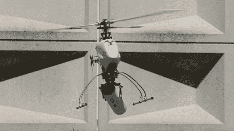

# 能够抓取有效载荷的机器人直升机

> 原文：<https://hackaday.com/2010/08/28/robotic-helicopter-that-can-grasp-a-payload/>

就像侠盗猎车手 RC 任务一样，[这款直升机可以抓取物体进行运输](http://www.eng.yale.edu/grablab/research.html#aerial)。它们不必是特殊的大小或形状，即使它们不在中心，它也可以抬起它们。这要归功于负载平衡手([最初是作为假肢](http://www.eng.yale.edu/grablab/research.html#proshands)开发的)，它依靠灵活的关节和肌腱状的闭合机制。正如你在[的视频](http://www.technologyreview.com/blog/editors/25677/)中看到的，轻型切碎机有一个机载摄像头，这样操作者就可以看到正在拾取的东西。这个小家伙毫不费力地举起超过一公斤的物体，同时在空中保持稳定。

[谢谢保罗]