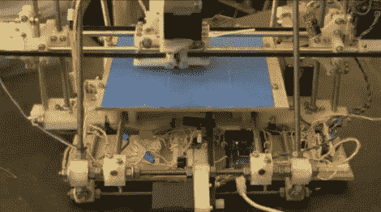

# 从 RepStrap 到 RepRap3D 打印机诞生了

> 原文：<https://hackaday.com/2010/08/29/from-repstrap-to-reprap-a-3d-printer-is-born/>

[加维兰·斯泰因曼]刚刚打印并组装了他自己的 RepRap 机器并拍摄了整个过程。这不是新闻，但我们发现看起来很有趣。他从[一台 RepStrap](http://reprap.org/wiki/RepStraps) 开始，这是一台快速原型 3D 打印机，由手工制造，而不是由类似的机器打印。这是自我复制过程中的重要一步。

在那里，他打印出了一个挤压头，提高了 RepStrap 可以生产的零件的质量。然后我们看到第二代 RepRap 机器 Mendel unit 的打印过程的延时镜头。休息之后我们嵌入了视频。这是在周日下午花十分钟的好方法。

 <https://www.youtube.com/embed/kqhq5p6cKpM?version=3&rel=1&showsearch=0&showinfo=1&iv_load_policy=1&fs=1&hl=en-US&autohide=2&wmode=transparent>

 </body> </html>