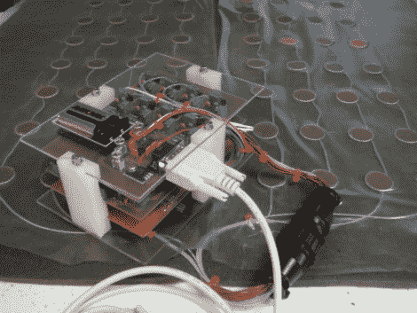

# 压力映射传感器垫

> 原文：<https://hackaday.com/2010/08/30/pressure-mapping-sensor-mat/>

[imsolidstate] built his own pressure sensitive mat. It utilizes two discs of copper clad board with a piece of foam in between for each of 64 sensors. As the foam gets compressed, the capacitance between the two pieces of copper changes, a measurement that is fairly easy to make with an analog to digital converter. The mat is being used to measure how well a horse saddle fits the animal. Data is read in through a serial port and then mapped using Excel. This prototype proves that the concept works but [imsolidstate] mentions that there’s room to improve the sensitivity and that there could be more noise filtering incorporated into the design.