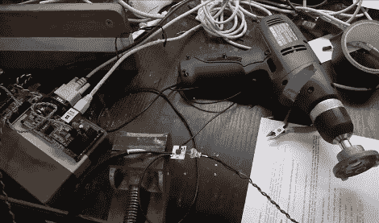

# 使用一个 PWM 连接控制交流钻机

> 原文：<https://hackaday.com/2010/08/31/controlling-an-ac-drill-using-one-pwm-connection/>

这种特殊的设置允许[Ben Krasnow]使用微控制器上的一个引脚[控制交流设备。他在用电钻做实验，并重新安置了让电钻旋转的触发电路。在板子上，他发现了一个可变电阻器和一个电容器，后者控制一个三端双向可控硅开关元件，驱动一个钻头的速度。[Ben 的]解决方案效果很好，将钻头与控制电路隔离开来。他用硫化镉光敏电阻代替可变电阻(基本上是一个可变电阻，其电阻取决于光的强度)。脉宽调制用于调节照射在光敏电阻上的 LED 的亮度，从而影响钻机的速度。这是对钻孔机的简单改造，我们称之为 MacGyver 式。](http://benkrasnow.blogspot.com/2010/08/universal-motor-speed-control-by.html)

休息后观看演示。

[https://www.youtube.com/embed/7yEABsNyRfo?version=3&rel=1&showsearch=0&showinfo=1&iv_load_policy=1&fs=1&hl=en-US&autohide=2&wmode=transparent](https://www.youtube.com/embed/7yEABsNyRfo?version=3&rel=1&showsearch=0&showinfo=1&iv_load_policy=1&fs=1&hl=en-US&autohide=2&wmode=transparent)