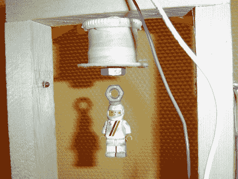

# 建造你自己的磁悬浮列车

> 原文：<https://hackaday.com/2010/08/31/build-your-own-magnetic-levitator/>

这是[一个巨大的磁悬浮器建造](http://uzzors2k.4hv.org/index.php?page=magneticlevitation)。[斯科特·哈登]在今天早上看到[那个令人敬畏的旋转地球仪](http://hackaday.com/2010/08/31/floating-globe-hacked-to-rotate/)后发现了这个链接。这个版本将物体悬挂在电磁体下方，但它有一个传感器系统，即使有效载荷不同，也能提供磁体和物体之间的恒定距离。这是通过几个红外传感器完成的。一个作为参考检测器，总是观察红外 LED 以获得基线测量。将该测量值与安装在稍低位置的第二个检测器进行比较。该电路调节电磁场，确保物体总是阻断近光束，但从不阻断参考光束。不需要微控制器，这由几个运算放大器处理。休息之后看看它的实际效果。

 <https://www.youtube.com/embed/tl0h4ivFIYA?version=3&rel=1&showsearch=0&showinfo=1&iv_load_policy=1&fs=1&hl=en-US&autohide=2&wmode=transparent>

 </body> </html>