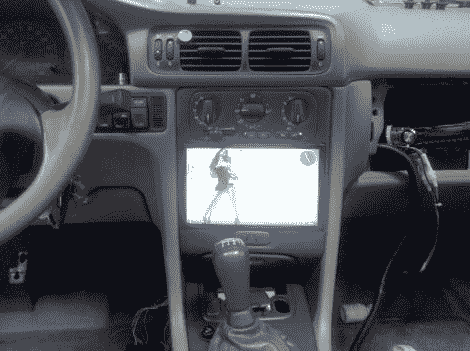
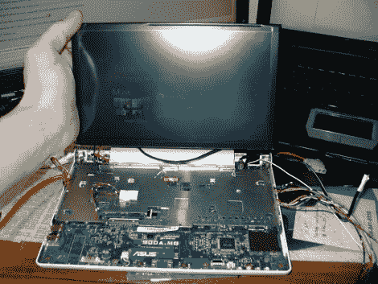
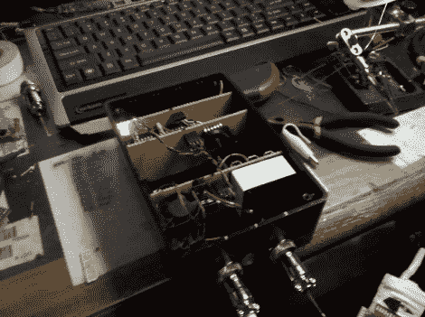
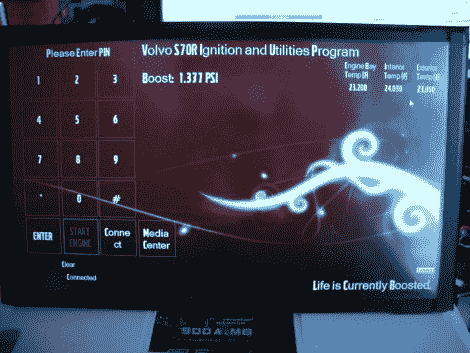
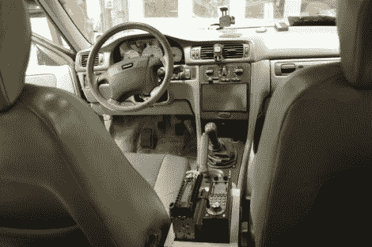

# 汽车电脑需要 PIN 才能点火

> 原文：<https://hackaday.com/2010/09/02/car-computer-requires-pin-for-ignition/>

[本的]在他的沃尔沃上增加了一些好东西，比如仪表板上的电脑。该系统监控两个压力传感器的增压和真空，以及直接读取转速，氧气和排气。所有这些都与 eeePC 900A 上运行的触摸界面紧密相关。但我们最喜欢的功能是，系统要求您输入 PIN 码来启动点火。上面链接的论坛帖子缺少细节，所以我们问[Ben]他是否能告诉我们更多。休息之后，请加入我们，观看演示视频以及[Ben]对该系统的概述。

[https://www.youtube.com/embed/_yPlFFCGi2A?version=3&rel=1&showsearch=0&showinfo=1&iv_load_policy=1&fs=1&hl=en-US&autohide=2&wmode=transparent](https://www.youtube.com/embed/_yPlFFCGi2A?version=3&rel=1&showsearch=0&showinfo=1&iv_load_policy=1&fs=1&hl=en-US&autohide=2&wmode=transparent)

本写道:

嗨，太好了，很高兴你喜欢。EEE 900A 有 2GB 内存升级和 16GB 固态硬盘升级，运行 windows 7。我修改了电脑，让它可以直接放在屏幕后面，这涉及到重新定位 USB 端口，还使用了一个坏笔记本电脑上的惠普网络摄像头作为备用摄像头。

黑匣子有三块电路板。回头给你发几张最新版本的图片。第一块板用于电源，它有一个 3.3v 和 5v 稳压器来提供两个电压轨和三个继电器。一个继电器控制上网本的电源，第二个控制汽车的实际启动器，第三个控制辅助电源和照明系统。

第二块板使用两个飞思卡尔半导体压力传感器，一个读取升压，另一个读取真空。它还有一个次级微控制器(PIC18F2550)来读取直接的 RPM 输入，以及排气中的宽带 o2 传感器。该 uC 在 i2c 从机模式下运行。

后面的最后一块电路板是 PIC18F4550，它可以直接控制继电器和次级控制器，还可以直接读取两个压力传感器。两个控制器都运行用 PICBASIC 编写的软件。

现在，我喜欢接口盒的部分是为了与计算机通话，它只使用 PIC18F4550 的 USB 端口。电脑只能通过一个 usb 接口与汽车交流。

上网本上运行的软件是一个应用程序，它提供了控制盒的前端，需要输入 PIN，一旦 PIN 正确，您就可以通过屏幕上的
按钮启动汽车。正常的钥匙启动方法已经不起作用了。为了安全起见，接口仅将 PIN 码发送到控制箱，控制箱在 PIC 的内部 eeprom 中保存并加密了 PIN 码。整个应用程序是用 VC++编写的。net，并在屏幕上为我提供准确的增压，真空，转速和 AFR。触摸屏幕上的仪表会将其放大，并最小化其他两个仪表以增强可读性。

这一切都干净地安装在我的 1998 年 S70 T5，这是一个自动从工厂，我换到手动在今年 1 月。要打开整个系统，只需按下遥控钥匙上的解锁按钮。等你到了车上，电脑已经在运行了，控制盒连上我的软件，在等待。通过遥控钥匙锁门(使用门上的钥匙也可以)告诉控制箱使用一个晶体管来电按 EEE 的电源按钮，并将其置于睡眠模式。一旦 EEE 关闭，它就会切断 EEE 的电源，然后两个控制器都进入睡眠模式，消耗最小的电流。我已经离开汽车几个星期了，整个东西都装好了，回到家，马上发动汽车，开走了。我像任何公司一样设计了整个系统，以确保可靠性。有一些只有我知道的安全措施，允许我在紧急情况下重新启用标准钥匙点火。