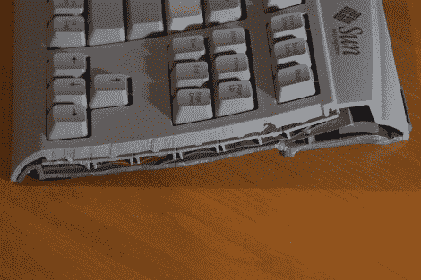

# 制作更小的键盘

> 原文：<https://hackaday.com/2010/08/31/making-a-smaller-keyboard/>

[Marek 的]笔记本电脑的键盘停止工作。他不想买替代品，所以决定开始使用外接键盘。但是拖着一个完整的 104 键模型有点痛苦，所以他决定给自己做一个更短的键盘。他基本上切掉了棋盘右侧的 10 键键盘。这产生了意想不到的后果，移除了将外壳顶部和底部固定在一起的螺钉，所以他最终增加了几个额外的螺钉来支撑它。你可能想知道如果关键矩阵的一部分被切掉了，它是如何工作的。[Marek]使用了简单的技巧，将膜的多余部分折叠起来，并用一些胶带覆盖未使用的触点。

如果你尝试这样做，你应该考虑去掉方向箭头和编辑键。一定有办法把那些钥匙映射到别处。也许[半 qwerty 键盘黑客](http://hackaday.com/2010/05/26/one-armed-coding-using-a-half-qwerty-hack/)会给你一些灵感。