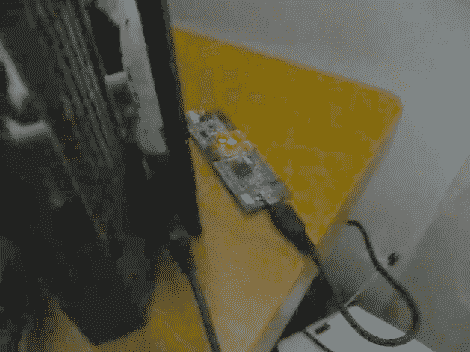

# Play Station 3 越狱开源版

> 原文：<https://hackaday.com/2010/09/01/open-source-version-of-the-play-station-3-jailbreak/>

不要偷。这是孩子们从小就被教导的一课，也是每个社会的核心原则。PSGroove 开始在几个方面遵循这个咒语。这是我们几周前介绍过的[PSJailbreak 硬件](http://hackaday.com/2010/08/19/modchip-hacks-ps3-via-usb-port/)的开源实现。很难找到关于该硬件的确切信息来源，但[许多人猜测原始设备包含被盗代码](http://www.ps3news.com/forums/ps3-hacks/psjailbreak-detectable-bannable-psn-dumped-easily-112074.html)。这是真是假还没有定论，因为 PSGroove 不包括被指控侵犯版权的备份管理程序。

该设备还旨在运行自制软件，并且不允许用户播放备份。它运行在各种 AVR 硬件上，包括 Teensy 板。如果你有其中的一个，这只是一个编译代码和释放你的 PlayStation 3 潜力的问题。

[感谢马克 via [PS3news](http://www.ps3news.com/PS3-Hacks/psgroove-open-source-ps-jailbreak-ps3-exploit-is-released/) ]