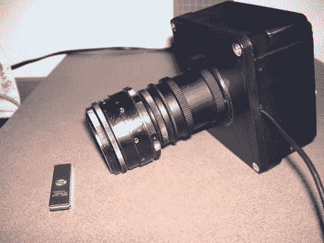

# 使用带网络摄像头的优质光学器件

> 原文：<https://hackaday.com/2010/09/01/using-quality-optics-with-a-webcam/>

[德文·克罗伊] [制作了一个盒子，将网络摄像头传感器与相机镜头](http://dcroy.blogspot.com/2010/08/webcam-details.html)连接起来。这个盒子是一个 PVC 导管盒，你可以在家庭中心找到。他使用 JB Weld 将四个螺栓连接到盒子的背面。这些用于微调网络摄像头传感器的安装板，以确保它位于镜头的焦点。镜头通过几根伸缩管连接到安装在盒子盖板中心的适配器上。上面的设置显示了一个微距镜头，[拍出了非常好的照片](http://dcroy.blogspot.com/2010/08/modified-webcam.html)。

如果你需要非常微小的东西的图像，你应该看看你相机的显微镜适配器。