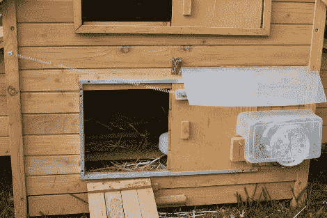

# 闹钟学习新技巧，开门

> 原文：<https://hackaday.com/2010/09/01/alarm-clock-learns-new-trick-opening-doors/>

早上五点半醒来。当他的小鸡开始哭着要求被放出来时，他也不喜欢这个主意。一个简单的解决方案显然是吃鸡造一个[自动开门器](http://hackaday.com/2010/05/03/automated-chicken-coop-door/)。这个机制从一个老式的机械闹钟开始，加上一个齿轮电机和一些创造性的开关工作来拉开门，整个事情不受天气影响，完成了。[马克]后来甚至修改了设置，以配合[垂直门](http://blog.stead.id.au/2010/06/new-chicken-coop.html)。两者都不需要 MCU。

再加上[自动喂食系统](http://hackaday.com/2010/01/31/recycled-cat-feeder/)、鸡蛋收集和烹饪设置，当你早上醒来时，你的早餐已经准备好一半了——就像我们其他人一样，大约在中午时分。

[感谢 MS3FGX]