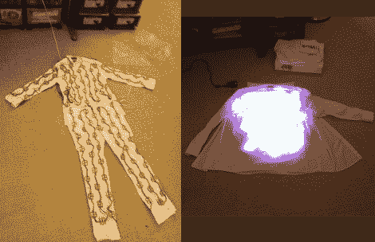

# LED 套装点亮夜晚

> 原文：<https://hackaday.com/2010/09/01/led-suit-lights-up-the-night/>

当提示线弹出[这个 led 套装](http://uiproductions.blogspot.com/2010/08/led-suit-part-1.html)、[第二部分](http://uiproductions.blogspot.com/2010/09/iphone-controlled-led-suit-part-2.html)，由【马克·德维迪茨】设计时，我们正在展示之前已知的 [EL 外套](http://hackaday.com/2010/08/10/out-now-el-coat-coming-soon-el-hat/)的简单 LED 版本。

在同样的情况下，我们是对是错。如果类似预测是正确的，那么结果将是非常好的。错就错在这套衣服在能力上远远超过了我们的预期。也就是说，一开始，一个通过 WiFi 的 iPhone 应用程序命令大约 200 个 Arduino 多路复用 RGB LED 模块随机跳舞或遵循模式；还植入了加速度计和麦克风，以进一步增强一些效果。最后，如果西装还不足以让你眼花缭乱，他的 PCB 和外壳铣削肯定会。休息后观看整个场景的视频。

 <https://www.youtube.com/embed/5ZSldyNCI10?version=3&rel=1&showsearch=0&showinfo=1&iv_load_policy=1&fs=1&hl=en-US&autohide=2&wmode=transparent>

 </body> </html>