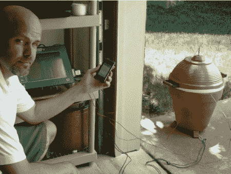

# 肉烟鬼会在完成后给你发短信

> 原文：<https://hackaday.com/2010/09/02/meat-smoker-texts-you-when-it-is-done/>

[Peter Rauch]制造了这款[熏肉机，拥有触摸屏控制界面](http://www.designnews.com/article/510217-Gadget_Freak_Case_170_Smoking_Permitted_but_Bring_a_Roast.php)。他的系统能够通过监控吸烟者的内部温度以及肉本身的温度来控制烹饪。他的触摸屏界面允许他输入他想要的参数，它基本上只是从那一点接管，并在完成时给他发短信。你将不得不[下载 pdf](http://www.designnews.com/file/25573-Gadget_Freak_170_Smoking_Permitted_but_Bring_a_Roast.pdf?force=true) 来获得他的构建的有趣细节，但这是一个有趣的阅读。

看起来他正在使用 4 回路 Gefran GFX4 温度控制器，结合 Modbus 远程终端接口和 TS8010 HMI 触摸屏来控制大部分电子设备。它甚至有保护限制，他可以设置，以防止他的家人将其提高到 1200 度。

[via [Makezine](http://blog.makezine.com/archive/2010/09/homebuilt_meat_smoker_texts_your_ph.html)