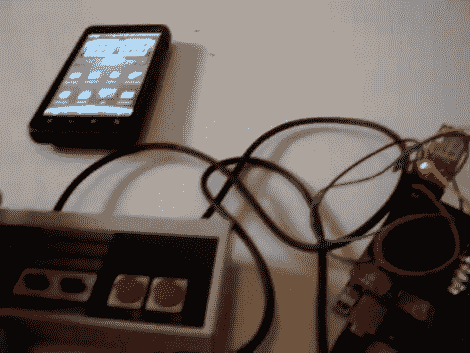

# 在安卓手机上使用 NES 控制器

> 原文：<https://hackaday.com/2010/09/02/using-an-nes-controller-on-an-android-phone/>

[Sk3tch]找到了一种方法来使用安卓系统的原装 NES 控制器。他在 DEFCON 上买了控制器和分线板。通过结合控制器、Arduino 和 [blueSMIRF 蓝牙模块](http://www.sparkfun.com/commerce/product_info.php?products_id=582)，控制器可以用作他的 Android 设备的键盘。在休息后的视频中，他演示了设备配对和在模拟器上玩超级马里奥兄弟 3。

他称之为阿尔法质量，但它看起来确实工作得很好。在测试版中，我们希望看到控制器外壳内所有额外的电子设备，如[那些 USB 模块](http://hackaday.com/2008/07/19/usb-nes-controller-plus/)。

[https://www.youtube.com/embed/_FZTz2KO9vU?version=3&rel=1&showsearch=0&showinfo=1&iv_load_policy=1&fs=1&hl=en-US&autohide=2&wmode=transparent](https://www.youtube.com/embed/_FZTz2KO9vU?version=3&rel=1&showsearch=0&showinfo=1&iv_load_policy=1&fs=1&hl=en-US&autohide=2&wmode=transparent)