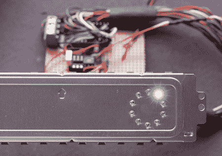

# Spindicator

> 原文：<https://hackaday.com/2010/09/03/the-spindicator/>

[Harvey]来信与我们分享了 Spindicator。spindicator 是一个硬盘活动指示器，内置在一个类似于迪卡侬的环中。使用来自硬盘活动 LED 的脉冲，[Harvey]测试了几种不同的方法来解释显示的数据。在插播之后，可以看到最终版本，由低通滤波器触发的负边沿。它很好，很平滑，隐约让人想起许多程序的加载屏幕。

他有关于这个项目的图片和大量细节，包括表现相当不稳定的以前版本的视频。

 <https://www.youtube.com/embed/94-Xc5M5gO4?version=3&rel=1&showsearch=0&showinfo=1&iv_load_policy=1&fs=1&hl=en-US&autohide=2&wmode=transparent>

 </body> </html>