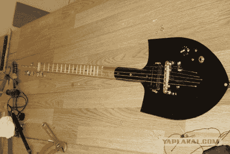

# 铲子…吉他？

> 原文：<https://hackaday.com/2010/09/04/shovel-guitar/>

当我们看到或听到这种黑客行为时，我们根本不相信。显然，用铲子做的吉他听起来并不像样。但是视频(跳转之后，跳到 2:40 的果酱)在我们未经训练的耳朵听起来相当不错。可能是做得非常好的木制品，正确使用工具，高科技皮卡，或者可能是俄罗斯魔术，我们不知道。

事实上，如果你继续看视频，它不会就此停止。创作者还用铲子制作了一把双弦贝斯和其他一些乐器。我是不是闻到了新铲子英雄的味道？

相关:用[不应该是吉他](http://hackaday.com/2009/10/15/nes-guitar/)的东西做出来的吉他。

[谢谢保罗]

[https://www.youtube.com/embed/RG7mhJbGFUI?version=3&rel=1&showsearch=0&showinfo=1&iv_load_policy=1&fs=1&hl=en-US&autohide=2&wmode=transparent](https://www.youtube.com/embed/RG7mhJbGFUI?version=3&rel=1&showsearch=0&showinfo=1&iv_load_policy=1&fs=1&hl=en-US&autohide=2&wmode=transparent)