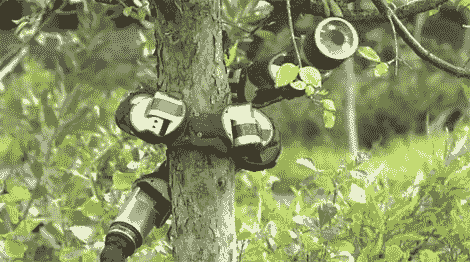

# 蛇形机器人爬树

> 原文：<https://hackaday.com/2010/09/06/snake-bot-climbs-trees/>

当你外出享受劳动节的庆祝活动时，请留意树上的机器蛇。CMU 机器人实验室制造了一个名为山姆大叔的蛇形机器人，它可以爬树和爬电线杆。正如你在休息后的视频中看到的，机器人似乎完全没有问题。它缠绕在树上，然后沿着整个身体的中心向下旋转。一旦到达山顶，它就可以欣赏风景了。虽然它看起来有点令人毛骨悚然，但至少它不在水里。

 <https://www.youtube.com/embed/8VLjDjXzTiU?version=3&rel=1&showsearch=0&showinfo=1&iv_load_policy=1&fs=1&hl=en-US&autohide=2&wmode=transparent>

 </body> </html>