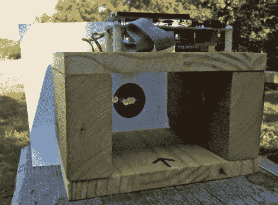

# 抛射体速度传感器

> 原文：<https://hackaday.com/2010/09/07/projectile-speed-sensor/>

[迈克]建造了一个传感器平台来测量抛射速度。该装置使用一个带有两个传感器的隧道。每一个都由一侧的激光二极管和另一侧的光电二极管组成。两者由运算放大器监控，由 ATmega128 微控制器测量。当光束被打断时，测量两个事件之间经过的时间，以便计算速度。有一个设置可以调整一系列速度的校准，这非常方便，因为[迈克]最初用橡皮筋测试了这个设备，然后转向粒子枪，然后是步枪。

他似乎是在玩命，射击距离他暴露的电路仅几英寸的目标，但他的枪法占了上风。我们在过去见过子弹速度探测器，只是用来看子弹移动的速度有多快，也用来让 T2 在正确的时刻捕捉撞击。