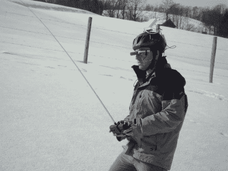

# 增强现实无人机控制器

> 原文：<https://hackaday.com/2010/09/10/augmented-reality-uav-controller/>

如果你有一个像杨奇煜·布兰克-帕克这样的增强现实系统，控制远程无人驾驶飞行器就容易多了。在飞机上，你会发现一个传感器套件和一个摄像头，两者都将数据传回给操作员。正如这篇文章的标题所示，操作员看到的显示屏增加了这些数据，包括高度、速度和各种超级方便的信息。例如，如果你在飞行中迷失了方向，会有一个指向家的箭头。还有一些关键信息，比如已经使用了多少毫安小时，这样你就可以避免电量耗尽，还有 GPS 数据可以用来定位被击落的飞机。休息之后看看一些飞行视频。

[https://www.youtube.com/embed/A54gyhhbJzE?version=3&rel=1&showsearch=0&showinfo=1&iv_load_policy=1&fs=1&hl=en-US&autohide=2&wmode=transparent](https://www.youtube.com/embed/A54gyhhbJzE?version=3&rel=1&showsearch=0&showinfo=1&iv_load_policy=1&fs=1&hl=en-US&autohide=2&wmode=transparent)