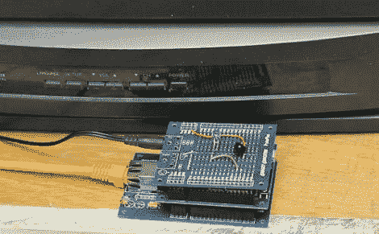

# 互联网遥控

> 原文：<https://hackaday.com/2010/09/10/internet-controlled-remote/>

这种情况多长时间发生一次？你要开始一次长途旅行，在半路上你记得电视还开着。从来没有？好吧，那么，如何从另一个房间控制 Xbox 360，而你没有遥控器。还是很少发生？

也许你有一个更好的情况，一个互联网控制的红外遥控器会很有用，它可以被编程为与任何电视或红外接收设备一起工作。[Nicholas McClanahan]从 Parallax 的 USB Propeller 开始，添加一个以太网模块，制作一个迷你服务器，最后是一个 IR LED 和接收器。代码就像组合[、SPIN](http://en.wikipedia.org/wiki/Parallax_Propeller) 、Html 和 JavaScript 一样简单。所有这些都集中在一个漂亮的网站图形用户界面下，提示发送什么红外信号。为了让这个项目更加简单明了，[Nicholas]还加入了一个[指令](http://www.instructables.com/id/Control-Your-TV-with-Your-Phone/)。最后，虽然这个软件很棒，但我们仍然试图找到一个足够好的用途。裂痕后的视频。

<https://player.vimeo.com/video/14622209>

 </body> </html>