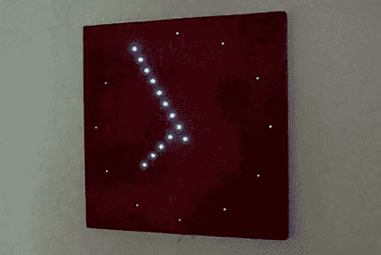

# 模拟风格的 LED 时钟

> 原文：<https://hackaday.com/2010/09/13/analog-style-led-clock/>

今天早上，我们看到了这个漂亮的 LED 时钟，对它的简洁结构印象深刻。它是模仿模拟时钟建造的，所以你有典型的小时标记和分针时针。分针在每个位置停留大约 2 到 3 分钟。所有这些 led 背后的大脑是 PIC 16f877 和 DS1307 实时时钟。总的来说，[WellyBoot]将 169 个 led 焊接到位，而且做得非常干净利落。我们怀疑，如果我们这样做了，它会像一堆意大利面条。您可以在他的网站上看到原理图和构建图片，或者在休息后观看视频。

[via [HackedGadgets](http://hackedgadgets.com/)

 <https://www.youtube.com/embed/M9nulOPBt_w?version=3&rel=1&showsearch=0&showinfo=1&iv_load_policy=1&fs=1&hl=en-US&autohide=2&wmode=transparent>

 </body> </html>