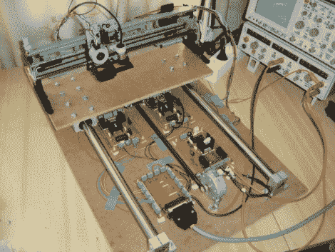

# 1 瓦激光雕刻机

> 原文：<https://hackaday.com/2010/09/13/1-watt-laser-engraver/>

这台激光雕刻机是用打印机零件、一个光盘托架和一些自制的电子板组装而成的。激光二极管是一个 1 瓦的模型，类似于我们在八月份看到的用作[的弱激光切割器](http://hackaday.com/2010/08/26/building-a-laser-cutter-from-a-weak-laser/)。当材料的宽度改变时，激光的焦点会受到影响，因此二极管安装在 CD-ROM 托架上(在 Z 轴上)以便于调整。X 轴和 Y 轴是使用 Epson Stylus 800 和 Epson Stylus Color II 打印机的零件制成的。休息之后，我们在一个 Ubuntu 盒子上嵌入了一段机器使用 [EMC2 软件](http://linuxcnc.org/)雕刻木头的视频。它还拥有切割纸张和一些塑料的能力，但在功率上无法与基于二氧化碳的装置相比。

 <https://www.youtube.com/embed/ZkeiuM3bOTk?version=3&rel=1&showsearch=0&showinfo=1&iv_load_policy=1&fs=1&hl=en-US&autohide=2&wmode=transparent>

 
[Thanks Panikos]
 </body> </html>