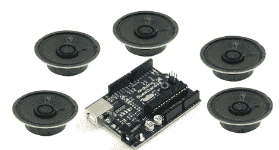

# 5 个音调，1 个 Arduino

> 原文：<https://hackaday.com/2010/09/14/5-tones-1-arduino/>

因为 Arduino 对同时产生[多种音乐音调](http://jeremyblum.com/2010/09/05/driving-5-speakers-simultaneously-with-an-arduino/)的需求很高；[Jeremy Blum]已经成功地计算出数学和其他必需品，将你以前生产单音的 MCU 变成生产 5 音的机器。不出所料，这真的只是 PWM 控制的一些创造性使用，但它最终都解决了，并有助于防止您购买额外的[声音生成芯片](http://hackaday.com/2010/08/15/ym2149-gets-new-life/)。这确实打开了一些新的大门，正如[杰瑞米]展示他仍在生产的[一样的东西](http://hackaday.com/2009/11/12/thingamawha-thingamagoop2/)项目:[反应](http://jeremyblum.com/2010/08/27/reacxion-build-progress/)。