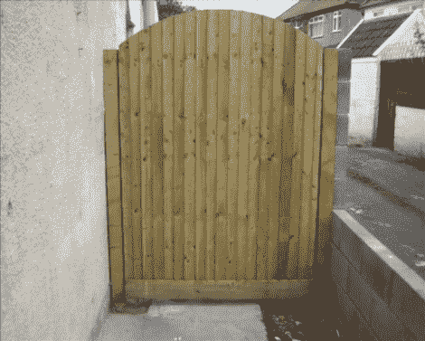

# 花园大门的自动入口

> 原文：<https://hackaday.com/2010/09/14/automated-entry-for-a-garden-gate/>

[丹·麦克格雷斯]告诉我们一个大多数人都没有的问题的解决方案。他为自己的花园大门建立了一个基于网络的进入系统。这并不像[的链条和链轮宿舍系统](http://hackaday.com/2010/09/11/keypad-door-lock-better-than-last-years-keyfob/)那么新颖，但它确实使用了一个键盘来输入。[丹的]已经有了一个网络服务器和家庭自动化盒，它一直在运行。他编写了一个网页，提供了一个用于代码输入的虚拟键盘。如果输入了正确的密码，系统就会打开大门另一边的电子锁。因为界面是一个网页，您可以从任何网络浏览器加载(休息后，iPhone 用于演示目的)。但是如果你不能上网，你就有麻烦了；没有实体键盘。但我们认为你可以跳过栅栏。 <https://www.youtube.com/embed/riJTvfJsTCI?version=3&rel=1&showsearch=0&showinfo=1&iv_load_policy=1&fs=1&hl=en-US&autohide=2&wmode=transparent>

 </body> </html>