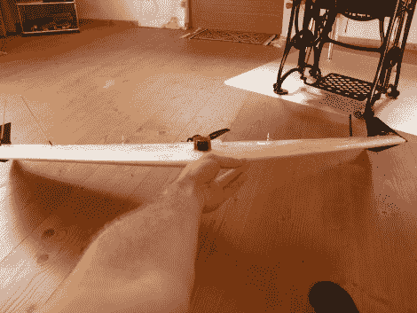

# 泽法建造和飞行镜头

> 原文：<https://hackaday.com/2010/09/14/ritewing-zephyr-build-and-flight-footage/>

那是架在这架飞机机翼上的摄像机。在他的泽法里安装了视频系统，他在奥地利阿尔卑斯山的试飞拍下了一些令人惊叹的视频。泡沫翼非常容易使用，这里的工具选择是一把热刀来为电子设备切出空腔。总的建造时间在 10 到 12 小时之间，但这并不是[Trappy]第一次使用这种模型。我们不确定他用什么设置来控制，我们猜测是[头戴式](http://hackaday.com/2010/09/10/augmented-reality-uav-controller/)的东西，但是休息后从驾驶舱看看吧。你会喜欢你所看到的。

[Trappy]通知 Hackaday，他计划下周末进行一些高度和距离测试。目标是达到 15000 英尺和 12 英里的航程。

 <https://www.youtube.com/embed/zrm3eqh9Yjk?version=3&rel=1&showsearch=0&showinfo=1&iv_load_policy=1&fs=1&hl=en-US&autohide=2&wmode=transparent>

 </body> </html>