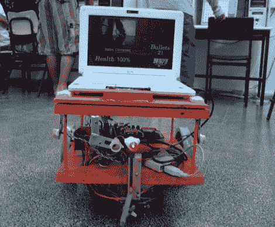

# 机器人激光标签

> 原文：<https://hackaday.com/2010/09/15/robot-laser-tag/>

[Shay]和他的朋友为一个学校项目制造了一些战斗机器人。不是用锯子或者火把摧毁对方的机器人，[而是在玩激光枪战](http://byshynet.com/index.php?id=60)。每个机器人都有一个 eeePC，一个活动臂上的激光指示器和一些光敏电阻。目标是让你的激光击中另一个机器人的光敏电阻来降低它的生命值。一个服务器跟踪比赛，监控射击，因为你不会在这个游戏中找到无限的弹药。至于驾驶装备，上网本的网络摄像头通过 Xbox 360 控制器传输到控制站，进行运动、瞄准和射击。休息之后来看看。

[https://www.youtube.com/embed/dqZ_a-yW2os?version=3&rel=1&showsearch=0&showinfo=1&iv_load_policy=1&fs=1&hl=en-US&autohide=2&wmode=transparent](https://www.youtube.com/embed/dqZ_a-yW2os?version=3&rel=1&showsearch=0&showinfo=1&iv_load_policy=1&fs=1&hl=en-US&autohide=2&wmode=transparent)