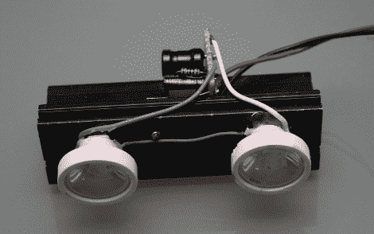

# Wii 感应棒投影仪

> 原文：<https://hackaday.com/2010/09/16/wii-sensor-bar-projector/>

在经历了让任天堂 Wii 遥控器与他的家庭影院投影仪可靠工作的相当多的麻烦后，[Sprite_TM] [设计了他自己的传感条替代品](http://spritesmods.com/?art=virtwiibar)。如果你不熟悉，Wii 遥控器的顶端有一个红外摄像头，可以感应位于电视上方或下方的传感条中的两个红外 led。问题是，如果你离得太远，光点就不在遥控器预期的位置，光标也不会像预期的那样工作。因为这是一个巨大的投影显示器，所以玩家离屏幕比系统设计的要远也就不足为奇了。

[Sprite _ TM]的解决方案是为这两个红外点构建一个投影系统。上图中的单元是一个驱动电路，两个红外发射器安装在一个散热器上，每个都有自己的反射器。反射光束通过菲涅尔透镜投射到电视图像所在的同一面墙上。观察者将看不到这种光，因为它的波长比可见光谱要长。但是 Wii 遥控器现在表现很好，替换的感应条很高兴地安装在投影仪上方看不见的地方。